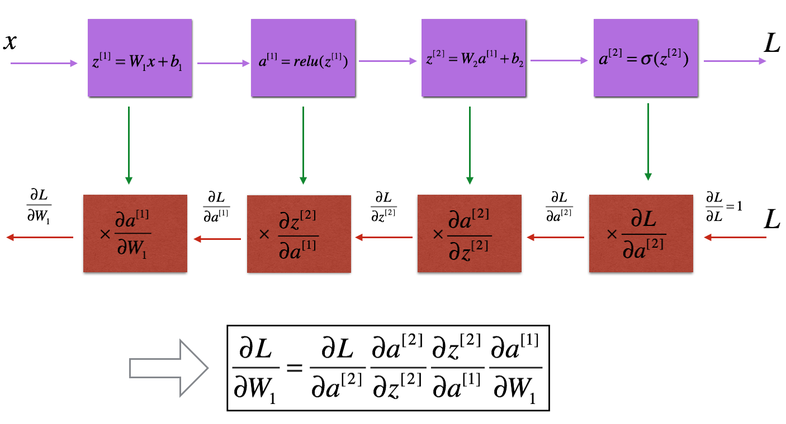
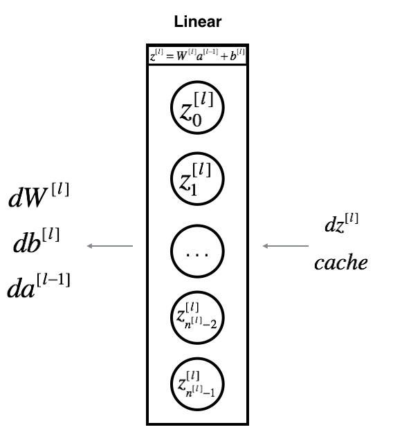
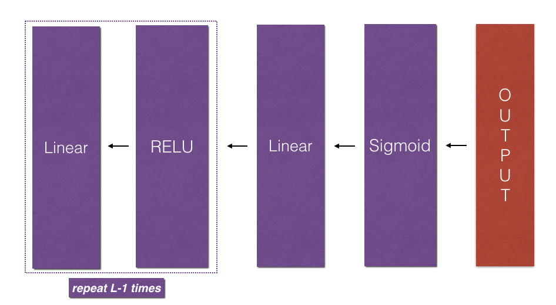

## 第四周：深层神经网络(Deep Neural Networks)
1. 符号定义
   - $L$: 神经网络层数
   - $x = a^{[0]}$: 输入特征
   - $n^{[l]}$: 第$l$层神经元个数
   - ${a}^{[l]}$: 第$l$层激活后结果
   - ${w}^{[l]}、{b}^{[l]}$: 第$l$层参数
2. 矩阵的维数
   1. ${{W}^{[l]}}$: $({{n}^{[l]}}$,${{n}^{[l-1]}})$；
   2. ${{b}^{[l]}}$ : $({{n}^{[l]}},1)$
   3. ${Z}^{[l]}、{A}^{[l]}$：$({n}^{[l]},m)$
3. 为什么用深层表示
   
   

   深度神经网络的这许多隐藏层中，较早的前几层能学习一些低层次的简单特征，等到后几层，就能把简单的特征结合起来，去探测更加复杂的东西。

   比如你录在音频里的单词、词组或是句子，然后就能运行语音识别了。

   神经网络在处理异或问题有两种结构:
   1. 小（隐藏单元数目）而且深（隐藏层数目） (深层神经网络)
   2. 大（隐藏单元数目）而且浅（隐藏层数目） (浅网络)

   很多数学函数用深度网络计算比浅网络要容易得多
4. 深层网络中的前向传播：

   
   1. ${{Z}^{[l]}}={{W}^{[l]}}{{a}^{[l-1]}}+{{b}^{[l]}}$
   2. ${{A}^{[l]}}={{g}^{[l]}}{({Z}^{[l]})}$
5. 深层网络中的反向传播:
   1. $d{{Z}^{[l]}}=d{{A}^{[l]}}*{{g}^{\left[ l \right]}}'\left({{Z}^{[l]}} \right)~~$
   2. $d{{W}^{[l]}}=\frac{1}{m}\text{}d{{Z}^{[l]}}\cdot {{A}^{\left[ l-1 \right]T}}$
   3. $d{{b}^{[l]}}=\frac{1}{m}\text{ }np.sum(d{{Z}^{[l]}},axis=1,keepdims=True)$
   4. $d{{A}^{[l-1]}}={{W}^{\left[ l \right]T}}.d{{Z}^{[l]}}$
6. 搭建神经网络
   
   
   1. Forward propagation:
      - Input: $A^{[l-1]}$
      - Output: $A^{[l]}$
   2. Compute cost:
      
      $J = \frac{1}{m}\sum_{i=1}^mL(\hat{y}, y)$
   3. Backward propagation:
      - Input: $dA^{[l]}$、$Z^{[l]}\,(in\,\,cache)$
      - Output: $dA^{[l-1]}$、$dW^{[l]}$、$db^{[l]}$
   4. Update: 
      - $W=W-αdW$
      - $b=b-αdb$
7. 参数VS超参数
   1. Parameters: $W^{[1]}、b^{[1]}、W^{[2]}、b^{[2]}\cdots$
   2. Hyperparameters: 
      - **learning rate** $a$（学习率）
      - **iterations**(梯度下降法循环的数量)
      - $L$（隐藏层数目）
      - $n^{[l]}$（隐藏层单元数目）
      - **choice of activation function**（激活函数的选择）
      - $\cdots\,\cdots$
   3. 寻找超参数的最优值:
   
      走Idea—Code—Experiment—Idea这个循环，尝试各种不同的参数，实现模型并观察是否成功，然后再迭代
8. L层神经网络具体分析
   - 模型的结构为 [LINEAR -> RELU] * (L-1) -> LINEAR -> SIGMOID
   1. Initialize：
      - Input：`layer_dims`，不同层中神经元数
      - Core Code:
      ```py
      parameters['W' + str(l)] = np.random.randn(layer_dims[l],layer_dims[l-1])*0.01
      parameters['b' + str(l)] = np.zeros((layer_dims[l],1))
      ```
      - Output：`parameter`，一个包含矩阵参数的**字典**（W1,b1,W2,b2$\cdots$），key为str，value为np.ndarray
   2. Forward Propagation:
      1. Linear Forward:
         $${{Z}^{[l]}}={{W}^{[l]}}{{a}^{[l-1]}}+{{b}^{[l]}}$$
         - Input: `A, W, b`，`A`为上一层输出
         - Core Code:
         ```py
         Z = np.dot(W, A) + b
         ```
         - Output: `Z, cache=(A, W, b)`，`cache`是一个包含上层输出`A`和本层参数`W, b`三个np.ndarray的**元组**
      2. Linear-Activation Forward:
         $$\sigma(Z) = \sigma(W A + b) = \frac{1}{ 1 + e^{-(W A + b)}}$$
         $$A = RELU(Z) = max(0, Z)$$
         - Input: `A_prev, W, b, activation = "sigmoid"or"relu"`
         - Core Code:
         ```py
         Z, linear_cache = linear_forward(A_prev,W,b)
         A, activation_cache = sigmoid(Z) or relu(Z)
         ```
         - Output: `A, cache = (linear_cache, activation_cache)`，其中`linear_cache`为线性正向的输出`cache`，`activation_cache`为包含`Z`的np.ndarray
      3. L-Layer Model Forward:
         > 使用for循环复制[LINEAR-> RELU]（L-1）次, 最后复制[LINEAR-> SIGMOID] 1次
         $$A^{[L]} = \sigma(Z^{[L]}) = \sigma(W^{[L]} A^{[L-1]} + b^{[L]})$$
         - Input: `X, parameters`
         - Core Code:
         ```py
         caches = []
         for l in range(1, L):
             A_prev = A 
             A, cache = linear_activation_forward(A_prev,parameters['W' + str(l)],parameters['b' + str(l)],activation = "relu")
             caches.append(cache)
         AL, cache = linear_activation_forward(A,parameters['W' + str(L)],parameters['b' + str(L)],activation = "sigmoid")
         caches.append(cache)
         ```
         - Output:`AL, caches`，`AL`为最终输出，`caches`为包含所有`cache`的np.ndarray
   3. Compute Cost
      $$J = -\frac{1}{m} \sum\limits_{i = 1}^{m} (y^{(i)}\log\left(a^{[L] (i)}\right) + (1-y^{(i)})\log\left(1- a^{[L](i)}\right))$$
      - Input: `AL, Y`
      - Core Code:
      ```py
      cost = -1 / m * np.sum(Y * np.log(AL) + (1-Y) * np.log(1-AL),axis=1,keepdims=True)
      ```
      - Output: `cost`
   4. Backward Propagation
      
      1. Linear Backward:

         
         $$ dW^{[l]} = \frac{\partial \mathcal{L} }{\partial W^{[l]}} = \frac{1}{m} dZ^{[l]} A^{[l-1] T}$$
         $$ db^{[l]} = \frac{\partial \mathcal{L} }{\partial b^{[l]}} = \frac{1}{m} \sum_{i = 1}^{m} dZ^{[l](i)}$$
         $$ dA^{[l-1]} = \frac{\partial \mathcal{L} }{\partial A^{[l-1]}} = W^{[l] T} dZ^{[l]}$$
         - Input:`dZ, cache = (A_prev, W, b)`
         - Core Code:
         ```py
         dW = 1 / m * np.dot(dZ ,A_prev.T)
         db = 1 / m * np.sum(dZ,axis = 1 ,keepdims=True)
         dA_prev = np.dot(W.T,dZ) 
         ```
         - Output:`dA_prev, dW, db`
      2. Linear-Activation Backward:
         $$dZ^{[l]} = dA^{[l]} * g'(Z^{[l]})$$. 
         - Input: `dA, cache = (linear_cache, activation_cache), activation = "relu"or"sigmoid"`
         - Core Code:
         ```py
         dZ = relu_backward(dA, activation_cache)
         #or
         dZ = sigmoid_backward(dA, activation_cache)
         dA_prev, dW, db = linear_backward(dZ, linear_cache)
         ```
         - Output:`dA_prev, dW, db`
      3. L-Layer Model Backward:

         
         - Input: `AL, Y, caches`
         - Core Code:
         ```py
         grads = {}
         dAL = - (np.divide(Y, AL) - np.divide(1 - Y, 1 - AL))
         #第L层
         current_cache = caches[L-1]
         grads["dA" + str(L)], grads["dW" + str(L)], grads["db" + str(L)] = linear_activation_backward(dAL, current_cache, activation = "sigmoid")
         #第1~L-1层
         for l in reversed(range(L - 1)):
            current_cache = caches[l]
            dA_prev_temp, dW_temp, db_temp = linear_activation_backward(grads["dA" + str(l+2)], current_cache, activation = "relu")
            grads["dA" + str(l + 1)] = dA_prev_temp
            grads["dW" + str(l + 1)] = dW_temp
            grads["db" + str(l + 1)] = db_temp
         ```
         - Output: `grads`
   5. Update Parameters
      $$ W^{[l]} = W^{[l]} - \alpha \text{ } dW^{[l]} $$
      $$ b^{[l]} = b^{[l]} - \alpha \text{ } db^{[l]} $$
      - Input: `parameters, grads, learning_rate`
      - Core Code:
      ```py
      for l in range(L):
          parameters["W" + str(l + 1)] = parameters["W" + str(l + 1)] - learning_rate * grads["dW" + str(l + 1)]
          parameters["b" + str(l + 1)] = parameters["b" + str(l + 1)] - learning_rate * grads["db" + str(l + 1)]
      ```
      - Output: `parameters`