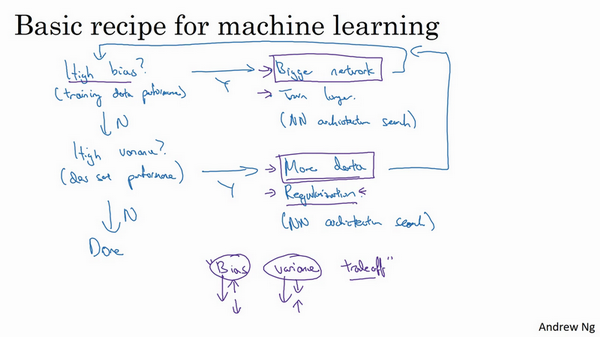
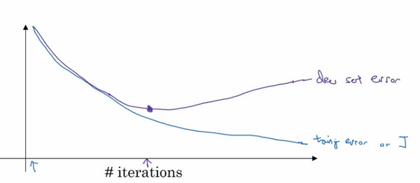

# 第二门课 改善深层神经网络：超参数调试、正则化以及优化

## 第一周：深度学习的实践层面
1. 训练，验证，测试集（Train / Dev / Test sets）
   
   在机器学习中，我们通常将样本分成训练集，验证集和测试集三部分，数据集规模相对较小，适用传统的划分比例(6:2:2)，数据集规模较大的，验证集和测试集要小于数据总量的20%或10%

   在机器学习中，如果只有一个训练集和一个验证集，而没有独立的测试集，遇到这种情况，训练集还被人们称为训练集，而验证集则被称为测试集
2. 偏差，方差（Bias/Variance）
   
   
   - High Bias: 上左，接近线性，欠拟合(数据拟合度低)
   - High Variance: 上右，过度拟合

   
   - High Bias: 训练集误差高(欠拟合)
   - High Variance: 验证集误差 远高于 训练集误差(过度拟合)
3. 机器学习基础

   
   - The revolution of **High Bias**:
     1. Pick a network having more layers or more units
     2. Train longer
     3. Find a more appropriate nerual network architecture
   - The revolution of **High Variance**:
     1. More data
     2. Regularization
     3. Find a more appropriate nerual network architecture
4. 正则化（Regularization）
   1. 正则化参数：$\lambda$
   2. 弗罗贝尼乌斯范数（Forbenius form \ L2 form）:
      $$||w||_F^2=\sum\limits_{i=1}^{n^{[l]}}\sum\limits_{j=1}^{n^{[l-1]}}(w_{ij}^{[l]})^2$$
   3. 逻辑回归函数中加入正则化:
      $$J = -\frac{1}{m} \sum\limits_{i = 1}^{m} (y^{(i)}\log\left(a^{[L] (i)}\right) + (1-y^{(i)})\log\left(1- a^{[L](i)}\right)) +\frac{\lambda}{2m}||w||_F^2$$
      ```py
      L2_regularization_cost = lambd/(2*m)*(np.sum(np.square(W1)) + np.sum(np.square(W2)) + np.sum(np.square(W3)) + ...)
      cost = cross_entropy_cost + L2_regularization_cost
      ```
   4. 梯度下降：
      $$dW^{[l]}=(from backprop)+\frac{\lambda}{m}W^{[l]}$$
      ```py
      dW = 1./m * np.dot(dZ, A_prev.T) + lambd/m * W
      ```
      $$W^{[l]}:=(1-\alpha\frac{\lambda}{m})W^{[l]}-\alpha(from backprop)$$
      > L2正则化也被称为权重衰减
5. 为什么正则化有利于预防过拟合?
   
   当$\lambda$增加到足够大，$W$会接近于0，使大量隐藏单元的影响变得更小，更不容易发生过拟合
   > 由于限制了网络过拟合训练集的能力，正则化会损害训练集的性能；但是，由于它最终可以提供更好的测试准确性，因此可以为你的系统提供帮助。
6. Dropout正则化
   
   Dropout(随机失活): 在网络中的每一层，为每个节点设置概率；设置完节点概率，我们会消除一些节点，然后删除掉从该节点进出的连线，最后得到一个节点更少，规模更小的网络，然后用backprop方法进行训练。
   
   
   
   

   这是网络节点精简后的一个样本，对于其它样本，我们照旧以抛硬币的方式设置概率，保留一类节点集合，删除其它类型的节点集合。**对于每个训练样本，我们都将采用一个精简后神经网络来训练它**

   **inverted dropout**（反向随机失活）：
   1. 定义向量$d$，$d^{[3]}$表示网络第三层的**dropout**向量
      ```py
      d3 = np.random.rand(a3.shape[0],a3.shape[1])
      ```
      在**python**中，$d^{[3]}$则是一个布尔型数组
   2. 设置keep_prob(保留隐藏单元概率)
      ```py
      d3 = (d3 < keep_prob)
      ```
      $d^{[3]}$是一个矩阵，每个样本和每个隐藏单元，其中$d^{[3]}$中的对应值为1的概率都是keep_prob，对应为0的概率是1 - keep_prob
   3. 处理激活函数
      ```py
      a3 = a3 * d3
      ```
      乘法运算最终把$d^{\left\lbrack3 \right]}$中相应元素输出，即让$d^{[3]}$中0元素与$a^{[3]}$中相对元素归零
   4. 向外扩展$a^{[3]}$
      ```py
      a3 = a3 / keep_prob
      ```
   > 在测试阶段不使用dropout函数

   对Dropout的解释：
   
   不于任何一个特征，因为该单元的输入可能随时被清除，因此该单元通过这种方式传播下去，并为单元的四个输入增加一点权重，通过传播所有权重，**dropout将产生收缩权重的平方范数的效果，并完成一些预防过拟合的外层正则化**，和L2正则化类似

   不同层的keep_prob也可以变化

   keep_prob=1，意味着保留所有单元
7. 其他正则化
   1. 数据扩增
      
      通过水平翻转图片，或随意裁剪图片，来增加训练集
   2. Early stopping
   
      
      - 在训练集上用0-1记录分类误差次数，呈单调下降趋势

      - 在验证集误差通常会先呈下降趋势，然后在某个节点处开始上升
      - 在迭代过程和训练过程中$w$的值会变得越来越大，比如在这儿，神经网络中参数$w$的值已经非常大了，所以early stopping要做就是在中间点停止迭代过程，得到一个$w$值中等大小的弗罗贝尼乌斯范数，
      - 缺点：因为提早停止梯度下降，也就是停止了优化代价函数$J$，因为现在你不再尝试降低代价函数$J$，所以代价函数$J$的值可能不够小
8. 归一化输入(Normalizing inputs)
   
   假设一个训练集有两个特征，输入特征为2维，归一化需要两个步骤：
   1. 零均值
      1. $\mu = \frac{1}{m}\sum_{i =1}^{m}x^{(i)}$
      2. $x:=x-\mu$
   2. 归一化方差；
      1. $\sigma^{2}= \frac{1}{m}\sum_{i =1}^{m}(x^{(i)})^{2}$
      2. $x/=\sigma^2$

   

   归一化后，数据就都为均值为0，方差为1的正态分布了
   > 归一化作用：使代价函数$J$更快地进行优化
9.  梯度消失/梯度爆炸
   
    当权重$W​$只比1略大一点，深度神经网络的激活函数将爆炸式增长；
   
    如果$W​$比1略小一点，深度神经网络的激活函数就会以指数级递减
10. 神经网络的权重初始化
    > 神经网络的权重初始化可以降低梯度消失和爆炸问题

    1. 为了设置$Var(w_{i})=\frac{1}{n}$，应设置某层权重矩阵$$w^{[l]} = np.random.randn( \text{shape})*\text{np.}\text{sqrt}(\frac{1}{n^{[l-1]}})$$
    2. 当用的是**Relu**激活函数，标准差设置为$\sqrt{\frac{2}{n^{[l-1]}}}$，即$\text{np.}\text{sqrt}(\frac{2}{n^{[l-1]}})$
    3. 当用的是**tanh**激活函数，标准差设置为$\sqrt{\frac{1}{n^{[l-1]}}}$或$\sqrt{\frac{2}{n^{[l-1]} + n^{\left[l\right]}}}$
11. 梯度的数值逼近: 使用双边误差公式进行梯度检验
    $$f^{'}(\theta) = \frac{f(\theta + \varepsilon ) - (\theta -\varepsilon)}{2\varepsilon}$$
    ```py
    thetaplus = theta + epsilon
    thetaminus = theta - epsilon
    Jplus = forward_propagation(x, thetaplus)
    Jminus = forward_propagation(x, thetaminus)
    gradapprox = (Jplus - Jminus) / (2 * epsilon)
    ```
12. 梯度检验 (Gradient checking)
    1. 把所有参数($W^{[1]}$、$b^{[1]}$……$W^{[l]}$、$b^{[l]}$)转换成一个巨大的向量数据$\theta$，该向量表示为参数$\theta$，最终得到了一个$\theta$的代价函数$J(\theta)$
    2. 把所有参数导数($dW^{[1]}$、${db}^{[1]}$……${dW}^{[l]}$、${db}^{[l]}$)转换成一个大向量$d\theta$，它与$\theta$具有相同维度
    3. 循环执行，从而对每个$i$也就是对每个$\theta$组成元素计算$d\theta_{\text{approx}}[i]$的值（只对$\theta_{i}​$增加$\varepsilon​$，其它项保持不变），即$$d\theta_{\text{approx}}\left[i \right] = \frac{J\left( \theta_{1},\theta_{2},\ldots\theta_{i} + \varepsilon,\ldots \right) - J\left( \theta_{1},\theta_{2},\ldots\theta_{i} - \varepsilon,\ldots \right)}{2\varepsilon}$$
    $$d\theta[i]\approx d\theta_{\text{approx}}\left[i \right]$$
    1. Check:$$\varepsilon = \frac{{||d\theta_{\text{approx}} -d\theta||}_{2}}{{||d\theta_{\text{approx}} ||}_{2}+{||d\theta||}_{2}}$$
       ```py
       numerator = np.linalg.norm(gradapprox - grad)
       denominator = np.linalg.norm(grad) + np.linalg.norm(gradapprox)
       difference = numerator / denominator
       ```
       - $\varepsilon<10^{-7}$: 无bug
       - $\varepsilon<10^{-5}$: 可能有bug
       - $\varepsilon<10^{-3}$: 很可能有bug
       > 欧几里得范数：$||a||_2 = \sqrt{\sum\limits_{i}^{n}(a_i)^2}$
13. 梯度检验应用的注意事项
    1. 不要在训练中使用梯度检验，它只用于调试
    2. 如果算法的梯度检验失败，要检查所有项，检查每一项，并试着找出**bug**
    3. 在实施梯度检验时，如果使用正则化，请注意正则项。
       
       如果代价函数$J(\theta) = \frac{1}{m}\sum_{}^{}{L(\hat y^{(i)},y^{(i)})} + \frac{\lambda}{2m}\sum_{}^{}{||W^{[l]}||}^{2}$，这就是代价函数$J$的定义，$d\theta$等于与$\theta$相关的$J$函数的梯度，包括这个正则项
    4. 梯度检验不能与**dropout**同时使用
    5. 在随机初始化过程中，运行梯度检验，然后再训练网络

       因为可能只有在$w$和$b$接近0时，**backprop**的实施才是正确的。但是当$W$和$b$变大时，它会变得越来越不准确