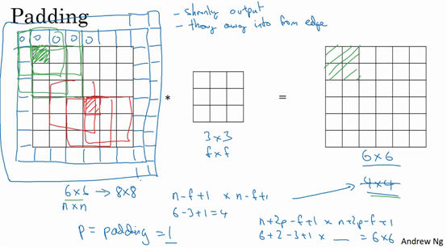
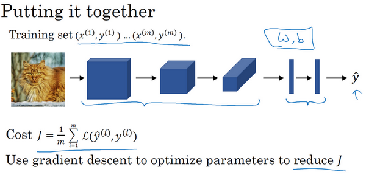

# 第四门课 卷积神经网络（Convolutional Neural Networks）

## 第一周 卷积神经网络
1. 边缘检测
   - 灰度图像：每个像素只有一个采样颜色的图像。灰度数值越高颜色越白；反之越黑
   - 边缘检测定义：标识数字图像中亮度变化明显的点

     

   - 二维卷积：（三个矩阵分别是input、filter、output）
     - 计算方法：filter从输入的最左上方开始，从左往右、从上往下进行滑动，进行元素乘法（element-wise products）运算
  
       

       下图左的过滤器检测垂直边缘；图右的过滤器检测水平边缘

       

       输出维度：$(n-f+1)×(n-f+1)$

    - Padding：
      - 二维卷积的缺点：
        1. 每次做卷积操作，你的图像就会缩小
        2. 角落或者边缘区域的像素点在输出中采用较少，意味着你丢掉了图像边缘位置的许多信息
      - 为了处理上述问题，可以对输入图像进行扩充：（$p$是填充的数量）
  
        

      输出维度：$(n+2p-f+1)×(n+2p-f+1)$

      - Same卷积：填充后，你的输出大小和输入大小是一样的，此时$p=(f-1)/2$
      - Valid卷积：不填充，即$p=0$
    - 卷积步长：
  
      

      输出维度为$⌊\frac{n + 2p - f}{s}+1⌋×⌊\frac{n + 2p - f}{s}+1⌋$，其中$⌊ ⌋$这是向下取整的符号
2. 三维卷积
   
   

   - 计算方法：与二维卷积相似，$n_c$层filter从输入的最左上方开始，从左往右、从上往下进行滑动，进行元素乘法（element-wise）
   - 作用：将第一个过滤器设为$\begin{bmatrix}1 & 0 & - 1 \\ 1 & 0 & - 1 \\ 1 & 0 & - 1 \\\end{bmatrix}$，和之前一样，而绿色通道全为0，$\begin{bmatrix} 0& 0 & 0 \\ 0 &0 & 0 \\ 0 & 0 & 0 \\\end{bmatrix}$，蓝色也全为0。如果你把这三个堆叠在一起形成一个3×3×3的过滤器，那么这就是一个检测垂直边界的过滤器，但只对红色通道有用；如果你不关心垂直边界在哪个颜色通道里，那么你可以用一个这样的过滤器，$\begin{bmatrix}1 & 0 & - 1 \\ 1 & 0 & - 1 \\ 1 & 0 & - 1 \\ \end{bmatrix}$，$\begin{bmatrix}1 & 0 & - 1 \\ 1 & 0 & - 1 \\ 1 & 0 & - 1 \\ \end{bmatrix}$，$\begin{bmatrix}1 & 0 & - 1 \\ 1 & 0 & - 1 \\ 1 & 0 & - 1 \\\end{bmatrix}$，所有三个通道都是这样。
   - 输出维度：如果你有一个$n \times n \times n_{c}$（通道数）的输入图像，然后卷积上一个$f×f×n_{c}$。然后你就得到了$（n-f+1）×（n-f+1）×n_{c^{'}}$，这里$n_{c^{'}}$其实就是下一层的通道数

     

     你可以通过使用多个过滤器卷积处理一个三维图像，以此来**检测多个特征**
3. 单层卷积网络
   
   

   Forward propagation：
   1. $z^{[l]}=W^{[l]}a^{[l]}+b^{[l]}$
   2. $a^{[l]}=g(z^{[l]})$

   

   神经网络的符号标记：
   1. $f^{[l]}=filter\,size$
   2. $p^{[l]}=padding$
   3. $s^{[l]}=stride$
   4. $n_c^{[l]}=number\,of\,filters$
   5. Size of Input: $n_H^{[l-1]}×n_W^{[l-1]}×n_c^{[l-1]}$
   6. Size of Output: $n_H^{[l]}×n_W^{[l]}×n_c^{[l]}$
   7. Size of filter: $f^{[l]}×f^{[l]}×n_c^{[l-1]}$
   8. Size of Activations: $n_H^{[l]}×n_W^{[l]}×n_c^{[l]}$
   9. Size of Weights: $f^{[l]}×f^{[l]}×n_c^{[l-1]}×n_c^{[l]}$
   10. Size of bias: $1×1×1×n_c^{[l]}$
   11. Size of whole parameters: $(f^{[l]}×f^{[l]}×n_c^{[l-1]}+1)×n_c^{[l]}$
   12. $n_H^{[l]}=⌊\frac{n_H^{[l-1]} + 2p^{[l]} - f^{[l]}}{s}+1⌋$

       $n_W^{[l]}=⌊\frac{n_W^{[l-1]} + 2p^{[l]} - f^{[l]}}{s}+1⌋$
4. 简单卷积网络示例

   

   **随着神经网络计算深度不断加深，高度和宽度会随着网络深度的加深而逐渐减小；而通道数量会随着网络深度的加深而增加。**

   典型的卷积神经网络：
   1. Convolution(CONV，卷积层)
   2. Pooling(POOL，池化层)
   3. Fully Connected(FC，全连接层)
5. 池化层
   
   
   
   Hyperparameters：
   1. f: filter size
   2. s: stride
   3. max or average of pooling
   
   最大池化只是计算神经网络某一层的静态属性，没有什么需要学习的。因此执行反向传播时，反向传播没有参数适用于最大池化。

   $n_H^{[l]}=⌊\frac{n_H^{[l-1]} - f^{[l]}}{s}+1⌋$

   $n_W^{[l]}=⌊\frac{n_W^{[l-1]} - f^{[l]}}{s}+1⌋$

6. 卷积神经网络示例

   神经网络常见模式：
   1. 几个卷积层+池化层->(flatten->)几个全连接层->一个softmax
   2. 一个或多个卷积层->一个池化层->(flatten->)几个全连接层->一个softmax
   > 进入全连接层之前需要先将输入展开(flatten)

   
   
   神经网络的激活值形状：
   1. Activation Size: $n_H^{[l]}×n_W^{[l]}×n_c^{[l]}$
   2. Parameters num: $(f^{[l]}×f^{[l]}×n_c^{[l-1]}+1)×n_c^{[l]}$

   

   有几点要注意：
   1. 池化层和最大池化层没有参数
   2. 卷积层的参数相对较少
7. 为什么使用卷积？

   
   1. 参数共享：特征检测如垂直边缘检测如果适用于图片的某个区域，那么它也可能适用于图片的其他区域。
   2. 稀疏连接：在每层中，每个输出值仅仅依靠一小部分的输入

   对各个层进行整合：

   