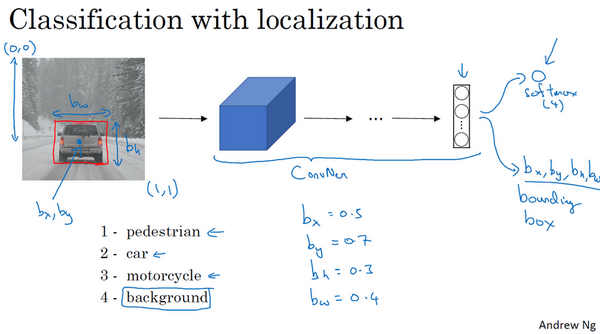
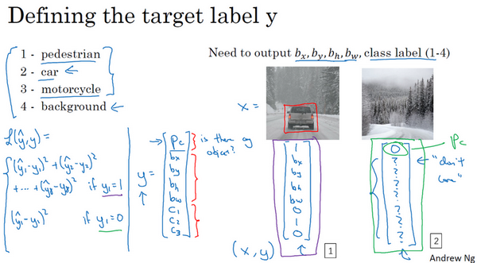
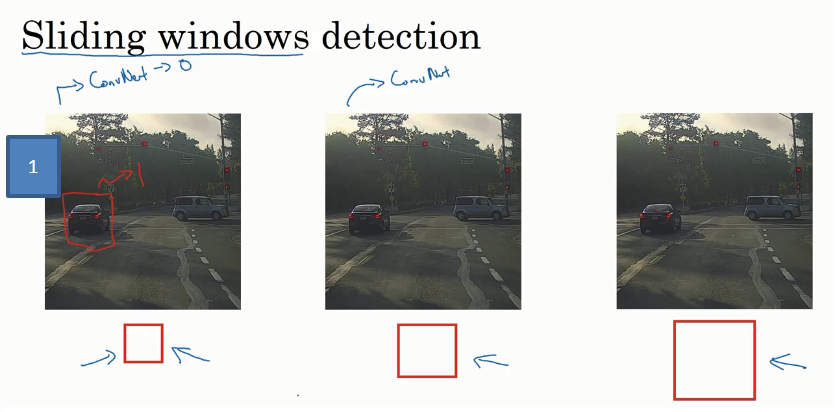
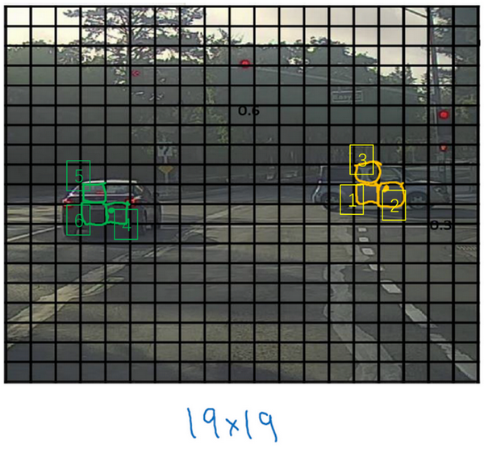

## 第三周 目标检测（Object detection）
1. 目标定位（Object localization）
   
   

   1. 输入一张图片到多层卷积神经网络
   2. 反馈给softmax单元来预测图片类型，对象可能包括以下几类：行人、汽车、摩托车和背景
   3. 如果有要检测的对象，进行定位，即让神经网络再多输出4个数字，标记为$b_{x}$,$b_{y}$(对象中心点坐标)和$b_{h}$，$b_{w}$(物体的宽和高)，这四个数字是被检测对象的边界框的参数化表示。

   

   监督学习任务定义目标标签 $y$:
   $$y= \ \begin{bmatrix} p_{c} \\ b_{x} \\ b_{y} \\ b_{h} \\ b_{w} \\ c_{1} \\ c_{2}\\ c_{3} \\\end{bmatrix}$$
   1. $p_{c}$表示是否含有对象，如果对象属于前三类（行人、汽车、摩托车），则$p_{c}= 1$，同时输出后七个参数；如果是背景，则图片中没有要检测的对象，则$p_{c} =0$，$y$的其它参数将变得毫无意义。
   2. $b_{x}$、$b_{y}$、$b_{w}$、$b_{h}$是被检测对象的边界框的参数化表示。
   3. $c_{1}$、$c_{2}$、$c_{3}$表示该对象属于1-3类中的哪一类，是行人，汽车还是摩托车。
   4. 损失函数：(采用平方误差策略)
   $$
   L\left(\hat{y},y \right) = \left\{ 
   \begin{matrix}
   \left( \hat{y_1} - y_{1} \right)^{2} + \left(\hat{y_2} - y_{2}\right)^{2} + \ldots\left( \hat{y_8} - y_{8}\right)^{2} \,\,y_1=1\\
   \left( \hat{y_1} - y_{1} \right)^{2} \,\,\,\,\,\,\,\,\,\,\,\,\,\,\,\,y_1=0\\
   \end{matrix}
   \right.
   $$
   - 实际应用中，你可以不对$c_{1}$、$c_{2}$、$c_{3}$和**softmax**激活函数应用对数损失函数，并输出其中一个元素值，通常做法是对边界框坐标应用平方差或类似方法，对$p_{c}$应用逻辑回归函数，甚至采用平方预测误差也是可以的。
2. 特征点检测
   
   神经网络可以通过输出图片上特征点的$(x,y)$坐标来实现对目标特征的识别

   

   假设你正在构建一个人脸识别应用。准备一个卷积网络和一些特征集，将人脸图片输入卷积网络，输出1或0，1表示有人脸，0表示没有人脸，然后输出（$l_{1x}$，$l_{1y}$）……直到（$l_{64x}$，$l_{64y}$）8，所以最终输出128+1=129个单元。当然为了构建这样的网络，你需要准备一个标签训练集，也就是图片$x$和标签$y$的集合，这些点都是人为辛苦标注的。
3. 目标检测（Object detection）
   
   滑动窗口目标检测: 基于滑动窗口(**Sliding windows detection**)的目标检测算法进行目标检测

   例：构建一个汽车检测算法
   1. 训练一个判断是否有车的CNN
   2. 用大小不同的窗口，以选定的步幅移动窗口，**遍历图像的每个区域，把这些剪切后的小图像输入卷积网络，对每个位置按0或1进行分类**   

      

      

   缺点：计算成本过高。
   1. 选用的步幅很大，显然会减少输入卷积网络的窗口个数，但是粗糙间隔尺寸可能会影响性能。
   2. 如果采用小步幅，传递给卷积网络的小窗口会特别多，这意味着超高的计算成本。
4. 滑动窗口的卷积实现（Convolutional implementation of sliding windows）
   1. 把神经网络的全连接层转化成卷积层
   
      

      让$n==f，s=1，p=0$，卷积操作后，输出结果为1×1
   2. 通过卷积实现滑动窗口对象检测算法
      
      

      假设输入给卷积网络的图片大小是14×14×3，测试集图片是16×16×3，现在给这个输入图片加上黄色条块。我们在这个16×16×3的小图像上滑动窗口，**卷积网络运行了4次，于是输出了4个标签**。
      - Size of input：$n×n$
      - Size of output：$(\frac{n}{2}-6)×(\frac{n}{2}-6)$
      - Size of sliding windows: $14×14$
      - 最大池化参数 代表 **滑动窗口的步幅**
      - 原理：把输入图像作为一张图片输入给卷积网络进行计算，其中的公共区域可以共享很多计算。

      一个更大的图片样本:

      

      

      优点：相比最基本的滑动窗口目标检测，卷积层上应用滑动窗口算法的内容**提高了整个算法的效率**。

      缺点：边界框的位置可能不够准确
5. Bounding Box预测（Bounding box predictions）
   
   **YOLO**算法：一个能得到更精准边界框的算法

   
   1. 在100×100的图像上放一个3×3的网格(**具体实现可能是19×19或更大**)
   2. 使用图像分类和定位算法，然后将算法应用到9个格子上，对于9个格子中的每一个指定一个标签$y= \ \begin{bmatrix} p_{c} \\ b_{x} \\ b_{y} \\ b_{h} \\ b_{w} \\ c_{1} \\ c_{2}\\ c_{3} \\\end{bmatrix}$
   3. 如果格子中有对象($p_c=1$)，取对象的中点，将这个对象分配给包含对象中点的格子，比如对于第4和第6个格子，$y=\begin{bmatrix} 1 \\ b_{x} \\ b_{y} \\ b_{h} \\ b_{w} \\ 0 \\ 1 \\0 \\ \end{bmatrix}$
   4. 因为有3×3个格子，所以目标输出尺寸是3×3×8
   5. 现在要训练一个输入为100×100×3(输入图像)的神经网络，然后**你有这些3×3×8的目标标签$y$**。当你用反向传播训练神经网络时，将任意输入$x$映射到这类输出向量$y$。
   6. Specify the bounding boxes：对于这个方框（编号1所示），我们约定左上这个点是$(0,0)$，然后右下这个点是$(1,1)$，而$b_x=0.4,b_y=0.3,b_h=0.9,b_w=0.5$；其中$b_{x}$和$b_{y}$必须在0和1之间，$b_{h}$和$b_{w}$可能会大于1
      
      

   优点：YOLO算法是卷积实现，实际上它的运行速度非常快，可以达到实时识别
6. 交并比（Intersection over union）

   交并比（loU）函数：计算两个边界框交集和并集之比

   一般约定，在计算机检测任务中，如果$loU≥0.5$(0.5是阈值)，就说检测正确，如果预测器和实际边界框完美重叠，**loU**就是1，即交集就等于并集。

   但如果你希望更严格一点，你可以将**loU**的阈值定得更高，比如说大于0.6或者更大的数字，但**loU**越高，边界框越精确。
   
   
7. 非极大值抑制（Non-max suppression）
   
   作用：只输出概率最大的分类结果，但抑制很接近，但不是最大的其他预测结果，确保你的算法对每个对象只检测一次

   

   假设你需要在这张图片里检测行人和汽车，你可能会在上面放个19×19网格，理论上这辆车只有一个中点，所以它应该只被分配到一个格子里，左边的车子也只有一个中点，所以理论上应该只有一个格子做出有车的预测。

   实践中当你运行对象分类和定位算法时，对于每个格子都运行一次，可能很多格子都会举手说我的$p_{c}$，我这个格子里有车的概率很高。

   所以当你运行算法的时候，最后可能会对同一个对象做出多次检测，**所以非极大值抑制做的就是清理这些检测结果。这样一辆车只检测一次，而不是每辆车都触发多次检测。**

   具体做法：

   
   
   1. 首先这个19×19网格上执行一下算法，你会得到19×19×8的输出尺寸。
   2. 看看每次报告每个检测结果相关的概率$p_{c}$
   3. 将所有的边界框$p_{c}$小于或等于某个阈值，比如$p_{c}≤0.6$的边界框去掉。
   4. 把概率最大的那个用高亮标记，表明找到一辆车
   5. 之后，非极大值抑制就会逐一审视剩下的矩形，所有和这个最大的边框有很高交并比(大于阈值)，高度重叠的其他边界框，那么这些输出就会被抑制。
8. Anchor Boxes
   
   作用：让一个格子检测出多个对象(实践中这种情况很少发生)

   **anchor box**的思路是，这样子，预先定义两个不同形状的**anchor box**，或者多个**anchor box**形状，你要做的是把预测结果和这两个**anchor box**关联起来。实际应用中，你可能会用更多的**anchor box**，可能要5个甚至更多

   

   定义类别标签，用的向量不再是上面这个$\begin{bmatrix} p_{c} & b_{x} &b_{y} & b_{h} & b_{w} & c_{1} & c_{2} & c_{3} \\\end{bmatrix}^{T}$，而是重复两次，$y=  \begin{bmatrix} p_{c} & b_{x} & b_{y} &b_{h} & b_{w} & c_{1} & c_{2} & c_{3} & p_{c} & b_{x} & b_{y} & b_{h} & b_{w} &c_{1} & c_{2} & c_{3} \\\end{bmatrix}^{T}$，前8个参数与box 1关联(行人)，后8个参数与box 2关联(车)

   一般手工指定anchor box形状，你可以选择5到10个anchor box形状，覆盖到多种不同的形状，可以涵盖你想要检测的对象的各种形状。或者使用k-means clustering
9. YOLO 算法

   
   1. 假设你要训练一个算法去检测三种对象，行人、汽车和摩托车，你还需要显式指定完整的背景类别。这里有3个类别标签，如果你要用两个**anchor box**，那么输出 $y$ 就是3×3×2×8，其中3×3表示3×3个网格，2是**anchor box**的数量，8是向量维度，8实际上先是5（$p_{c},b_{x},b_{y},b_{h},b_{w}$）再加上类别的数量（$c_{1},c_{2},c_{3}$）。你可以将它看成是3×3×2×8，或者3×3×16。要构造训练集，你需要遍历9个格子，然后构成对应的目标向量$y$。
   2. 如果格子里没什么有价值的东西(如格子1)，$y= \begin{bmatrix} 0 & ? & ? & ? & ? & ? & ? & ? & 0 & ? & ? & ? & ? & ? & ? & ?\\ \end{bmatrix}^{T}$；如果格子里只有车(如格子2)，$y =\begin{bmatrix} 0 & ? & ? & ? & ? & ? & ? & ? & 1 & b_{x} & b_{y} & b_{h} &b_{w} & 0 & 1 & 0 \\\end{bmatrix}^{T}$
   3. 所以你这样遍历9个格子，遍历3×3网格的所有位置，你会得到这样一个向量，得到一个16维向量，所以最终输出尺寸就是3×3×16
   4. 最后你要运行一下这个非极大值抑制，抛弃概率很低的预测；对于每个类别单独运行非极大值抑制，处理预测结果所属类别的边界框，用非极大值抑制来处理行人类别，用非极大值抑制处理车子类别，然后对摩托车类别进行非极大值抑制，运行三次来得到最终的预测结果。

      

10. 候选区域
    
    选出候选区域的方法是运行图像分割算法，分割的结果是下边的图像

    

    R-CNN(区域CNN)：找出可能2000多个色块，然后在这2000个色块上放置边界框，然后在这2000个色块上运行分类器，这样需要处理的位置可能要少的多，可以减少卷积网络分类器运行时间，比在图像所有位置运行一遍分类器要快。

    缺点：速度远慢于YOLO