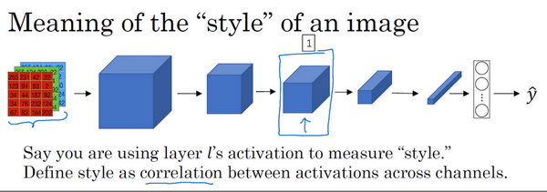

## 第四周 特殊应用：人脸识别和神经风格转换
1. 什么是人脸识别？
   - 人脸验证（face verification）:有一张输入图片，以及某人的ID或者是名字，这个系统要做的是，验证输入图片是否是这个人。(**1对1问题**)
   - 人脸识别（face recognition）:输入图片，跟数据库中  K个人脸数据比对，并判断识别的人脸(**1对K问题**)
2. One-Shot学习
   
   为了让人脸识别能够做到一次学习，应该使用Similarity函数 ($\tau$是阈值)
   $$d(img1,img2) = degree\ of\ difference\ between\ images$$
   $$If\ d(img1,img2)\ \leq\ \tau$$
   $$If\ d(img1,img2)\ >\ \tau$$
3. Siamese 网络
   
   
   
   1. 输入图片$x^{(1)}$进入CNN，最后使用fully connected得到128个数(编码)，得到$f(x^{(1)})$；
   2. 用同样的网络输入$x^{(2)}$，得到$f(x^{(2)})$；
   3. 最终得到编码之差的范数$d( x^{( 1)},x^{( 2)}) =|| f( x^{( 1)}) - f( x^{( 2)})||^{2}$。
   4. 如果$x^{(i)}$、$x^{(j)}$是相同的人，$d( x^{(i)},x^{(j)})$很小；反之很大。训练该网络的方法就是用反向传播来改变这些所有的参数，以确保满足这些条件。
4. Triplet 损失 (三元组损失函数)
   
   为了应用三元组损失函数，你需要比较成对的图像：通常是看一个 **Anchor** 图片，你想让**Anchor**图片和**Positive**图片的距离很接近。你会想让**Anchor**图片与**Negative**图片的距离离得更远一点。

   
   $$L( A,P,N) = max(|| f( A) - f( P)||^{2} -|| f( A) - f( N)||^{2} + a,0)$$
   $$J=\sum_{i=1}^mL(A^{(i)},P^{(i)},N^{(i)})$$
   $a$是间隔(margin)，是超参数，一般至少0.2。它的作用是拉大了**Anchor**和**Positive** 图片对和**Anchor**与**Negative** 图片对之间的差距。

   这个$max$函数的作用就是，只要这个$|| f( A) - f( P)||^{2} -|| f( A) - f( N)||^{2} + a>0$，会得到一个正的损失值。通过最小化这个损失函数达到的效果就是使这部分$|| f( A) - f( P)||^{2} -||f( A) - f( N)||^{2} +a$成为0，或者小于等于0。

   为了定义三元组的数据集你需要**成对的$A$和$P$**，即同一个人的成对的图片，并把它做成很多三元组

   **如果随机选择A,P,N，有很大可能$L(A,P,N)=0$，这样网络并不能从中学到什么，因此你要做的就是尽可能选择难训练的三元组$A$、$P$和$N$，即让即$d(A,P) \approx d(A,N)$，这样你的学习算法会竭尽全力使这个式子变大（$d(A,N)$），或者使这个式子（$d(A,P)$）变小**
5. 人脸验证与二分类
   
   
   把人脸识别问题转换为一个二分类问题: 选取**Siamese**网络，使其同时计算这些嵌入，比如说128维，然后将其输入到逻辑回归单元，然后进行预测，如果是相同的人，那么输出是1，若是不同的人，输出是0。
   $$\hat y = \sigma(\sum_{k = 1}^{128}{w_{i}| f( x^{( i)})_{k} - f( x^{( j)})_{k}| + b})$$
   $| f( x^{( i)})_{k} - f( x^{( j)})_{k}|$可以被替代成$\chi^{2}$公式 $\frac{(f( x^{( i)})_{k} - f(x^{( j)})_{k})^{2}}{f(x^{( i)})_{k} + f( x^{( j)})_{k}}$

   使用该算法的一个优点是，不需要每次都计算这些特征或是嵌入，你可以**提前计算好**，那么当一个新员工走近时，你可以使用上方的卷积网络来计算这些编码，然后使用它，和预先计算好的编码进行比较，然后输出预测值$\hat y$。
6. 什么是神经风格迁移？
   
   使用$C$来表示内容图像，$S$表示风格图像，$G$表示生成的图像。

   
7. CNN特征可视化
   
   
   1. 找到使每一层那些使得每一个单元激活最大化的一些图片，或者是图片块
   2. 更深的层检测的特征变得更加复杂
8. 代价函数（Cost function）
   
   $$J( G) = a J_{\text{content}}( C,G) + \beta J_{\text{style}}(S,G)$$
   1. 先随机初始化G
   2. 使用梯度下降的方法将G最小化，更新$G:= G - \frac{\partial}{\partial G}J(G)$ (上更新的是图像$G$的像素值)
   
   
9. 内容代价函数$J_{\text{content}}( C,G)$（Content cost function）
    
   1. 用隐含层$l$来计算内容代价，通常$l$会选择在网络的中间层，既不太浅也不很深
   2. 用一个预训练的卷积模型，可以是**VGG网络**
   3. 令$a^{[l][C]}$和$a^{[l][G]}$，代表这两个图片$C$和$G$的$l$层的激活函数值
   4. 如果这两个激活值相似，那么就意味着两个图片的内容相似。
   $$J_{\text{content}}( C,G) = \frac{1}{2}|| a^{[l][C]} - a^{[l][G]}||^{2}$$
      或
   $$J_{content}(C,G) =  \frac{1}{4 \times n_H \times n_W \times n_C}\sum _{ \text{all entries}} (a^{(C)} - a^{(G)})^2$$
10. 风格代价函数$J_{\text{style}}(S,G)$（Style cost function）
    
    1. 将图片的风格定义为$l$层中**各个通道之间激活项的相关系数**。
 
       
    2. 取得红黄个$n_{H}\times n_{W}$的通道中所有的数字对后，计算它们的相关系数
 
       
    3. 红色的通道（编号1）对应的是这个神经元，它能找出图片中的特定位置是否含有这些垂直的纹理（编号3），而第二个通道也就是黄色的通道（编号2），对应这个神经元（编号4），它可以粗略地找出橙色的区域。相关系数描述的就是当图片某处出现这种垂直纹理时，该处又同时是橙色的可能性。

       
    4. 设$a_{i,\ j,\ k}^{[l]}$，设它为隐藏层l中$(i,j,k)$位置的激活项,$i$，$j$，$k$分别代表该位置的高度、宽度以及对应的通道数；$G^{[l]( S)}$是一个$n_{c} \times n_{c}$的矩阵；$k$和$k'$元素被用来描述$k$通道和$k'$通道之间的相关系数
       $$G_{kk^{'}}^{[l]( S)} = \sum_{i = 1}^{n_{H}^{[l]}}{\sum_{j = 1}^{n_{W}^{[l]}}{a_{i,\ j,\ k}^{[l](S)}a_{i,\ j,\ k^{'}}^{[l](S)}}}$$
    5. 然后，我们再对生成图像做同样的操作:
       $$G_{kk^{'}}^{[l]( G)} = \sum_{i = 1}^{n_{H}^{[l]}}{\sum_{j = 1}^{n_{W}^{[l]}}{a_{i,\ j,\ k}^{[l](G)}a_{i,\ j,\ k^{'}}^{[l](G)}}}$$
       
    6. 风格代价函数：
       $$J_{style}^{[l]}(S, G)= \frac{1}{(2n_{H}^{[l]l}n_{W}^{[l]}n_{C}^{[l]})^2}||G^{[l](S)}-G^{[l](G)}||_F^2$$
       $$J_{style}(S, G) = \sum_l\lambda^{[l]}J_{style}^{[l]}(S, G)$$
    7. 为了把这些东西封装起来，你现在可以定义一个全体代价函数：
       $$J(G) = a J_{\text{content}( C,G)} + \beta J_{{style}}(S,G)$$
11. 一维到三维推广（1D and 3D generalizations of models）
    1. 一维：
       
    2. 三维：
       