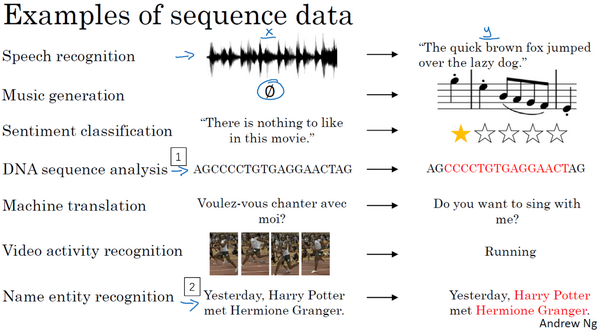
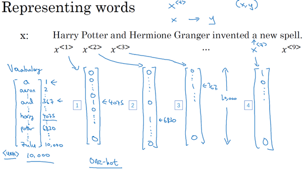

# 第五门课 序列模型(Sequence Models)

## 第一周 循环序列模型（Recurrent Neural Networks）
1. 为什么选择序列模型？（Why Sequence Models?）
   
   
2. 数学符号（Notation）
   - $x^{(i)<t>}$: 输入数据中 第$i$个训练样本中第$t$个元素
   - $y^{(i)<t>}$: 输出数据中 第$i$个训练样本中第$t$个元素
   - $T_{x}^{(i)}$：第$i$个训练样本的输入序列的长度
   - $T_{y}^{(i)}$：第$i$个训练样本的输出序列的长度

   例：建立一个能够自动识别句中人名位置的序列模型

   

   如果你选定了10,000词的词典，那么vocabulary中每个数字代表着代词的索引

   接下来用one-hot表示法来表示词典里的每个单词。

   如果遇到了一个不在你词表中的单词，用\<**UNK**\>（代表unknown）作为标记
3. 循环神经网络模型（Recurrent Neural Network Model）
   
   

   可以看到，**在每一个时间步中，循环神经网络传递一个激活值到下一个时间步中用于计算**。

   在整个流程中，在零时刻需要构造一个激活值$a^{<0>}$，这通常是零向量。有些研究人员会随机用其他方法对其初始化

   循环神经网络是从左向右扫描数据，同时**每个时间步的参数也是共享的**
   - $W_{aa}$: 表示管理着从$x^{<t>}$到隐藏层的连接的一系列参数
   - $W_{ax}$: 决定激活值 (水平) 联系
   - $W_{ya}$: 表示管理着从隐藏层到$y^{<t>}$的连接的一系列参数
   - $W_a$: $[ {{W}_{aa}}\vdots {{W}_{ax}}]$
   - $W_y$: $W_{ya}$

   这个循环神经网络的一个缺点就是它只使用了这个序列中之前的信息来做出预测 (双向循环神经网络（BRNN）会解决该问题)  

   - Forward Propagation:
  
     

     循环神经网络用的激活函数经常是**tanh**，不过有时候也会用**ReLU**; 而选用哪个激活函数是取决于你的输出$y$

     $$a^{< t >} = g_{1}(W_{aa}a^{< t - 1 >} + W_{ax}x^{< t >} + b_{a})$$
     $$\hat y^{< t >} = g_{2}(W_{{ya}}a^{< t >} + b_{y})$$
     公式简化后：$(W_{a}\left\lbrack a^{< t-1 >},x^{<t>} \right\rbrack = [ {{W}_{aa}}\vdots {{W}_{ax}}]×\begin{bmatrix} a^{< t - 1 >} \\ x^{< t >} \\ \end{bmatrix})$
     $$a^{<t>} =g(W_{a}\left\lbrack a^{< t-1 >},x^{<t>} \right\rbrack +b_{a})$$
     $$\hat y^{< t >} = g(W_{y}a^{< t >} +b_{y})$$

4. 通过时间的反向传播（Backpropagation through time）
   
   1. 元素$t$的损失函数: $$L^{<t>}( \hat y^{<t>},y^{<t>}) = - y^{<t>}\log\hat  y^{<t>}-( 1- y^{<t>})log(1-\hat y^{<t>})$$
   2. 整个序列的损失函数: $$L(\hat y,y) = \ \sum_{t = 1}^{T_{x}}{L^{< t >}(\hat  y^{< t >},y^{< t >})}$$
   3. Backpropagation through time：
   
      对于反向传播，需要从右到左进行计算（与正向传播方向相反），就像时间倒流

      
5. 不同类型的循环神经网络（Different types of **RNN**s）
   
   

6. 语言模型和序列生成（Language model and sequence generation）
   > \<EOS>: 标记句子结尾

   语言模型(如生成指定风格的文本)：告诉你某个特定的句子它出现的概率大小

   如何建立一个语言模型:
   1. 对训练集内的文本完成标识化
      - 建立一个字典，然后将每个单词都转换成对应的one-hot向量
   2. 构建一个RNN来构建这些序列的概率模型
      - 将$x^{<0>}$设为$\vec{0}$
      - 用$x^{<1>}$激活$a^{<0>}(=\vec{0})$
      - $a^{<1>}$会通过**softmax**进行一些预测来计算出第一个词可能会是什么（字典中的任意单词会是第一个词的概率）
      - 在第N个时间步，$x^{<n>} = y^{<n-1>}$，即把前n个预测出的单词告诉它，然后计算出字典中的任意单词会是第N个词的概率
   
   
7. 对新序列采样
   
   在你训练一个序列模型之后，要想了解到这个模型学到了什么，一种非正式的方法就是进行一次新序列采样，来看看到底应该怎么做。

   1. 输入$x^{<1>} =0$，$a^{<0>} =0$，根据得到的softmax中概率的分布进行采样（可以使用`np.random.choice`命令），得到$y^{<2>}$
   2. $x^{<n>} = y^{<n-1>}$，再次用对**softmax**进行采样，得到预测值$\hat y^{<n>}$
   3. 直到得到EOS标识 或是 到达到所设定的时间步，停止采样过程

   
8. 循环神经网络的梯度消失（Vanishing gradients with **RNN**s）
   
   对于RNN，首先从左到右前向传播，然后反向传播。但是反向传播会很困难，因为**梯度消失的问题**，后面层的输出误差很难影响前面层的计算
9. **GRU**单元（Gated Recurrent Unit（**GRU**））
   
   GRU优点：
   1. 改变了RNN的隐藏层，使其可以更好地捕捉深层连接
   2. 改善了梯度消失问题
   
   

   符号：
   1. $c^{<t>}$: 记忆细胞，$c^{<t>} = a^{<t>}$，用来记忆之前的单词
   2. ${\tilde{c}}^{<t>}$: 记忆细胞候选值，${\tilde{c}}^{<t>} =tanh(W_{c}\left\lbrack c^{<t-1>},x^{<t>} \right\rbrack +b_{c})$，使用更新门$\Gamma_{u}$来决定是否要用${\tilde{c}}^{<t>}$ 更新$c^{<t>}$
   3. $\Gamma_{u}$: 更新门，范围0~1，用来决定是否要更新$c^{<t>}$
   4. $\Gamma_{r}$: 相关门，范围0~1，用来计算出的下一个$c^{<t>}$的候选值${\tilde{c}}^{<t>}$跟$c^{<t-1>}$有多大的相关性

   公式：
   $${\tilde{c}}^{<t>}=tanh(W_c[\Gamma_{r}*c^{<t-1>},x^{<t>}]+b_c)$$
   $$\Gamma_{u}= \sigma(W_{u}\left\lbrack c^{<t-1>},x^{<t>} \right\rbrack + b_{u})$$
   $$\Gamma_{r}= \sigma(W_{r}\left\lbrack c^{<t-1>},x^{<t>} \right\rbrack + b_{r})$$
   $$c^{<t>}=\Gamma_{u}*{\tilde{c}}^{<t>}+(1-\Gamma_{u})+{\tilde{c}}^{<t-1>}$$
   $$a^{<t>} = c^{<t>}$$
10. 长短期记忆（**LSTM**（long short term memory）
    
    LSTM是一个比GRU更加强大和通用的版本

    符号：
    1. $\Gamma_{f}$: 遗忘门，使用单独的更新门$\Gamma_{u}$和遗忘门$\Gamma_{f}$去维持旧的值$c^{<t-1>}$或者就加上新的值${\tilde{c}}^{<t>}$
    2. $\Gamma_{o}$: 输出门

    

    公式：
    $${\tilde{c}}^{<t>}=tanh(W_c[c^{<t-1>},x^{<t>}]+b_c)$$
    $$\Gamma_{u}= \sigma(W_{u}\left\lbrack c^{<t-1>},x^{<t>} \right\rbrack + b_{u})$$
    $$\Gamma_{f}= \sigma(W_{f}\left\lbrack c^{<t-1>},x^{<t>} \right\rbrack + b_{f})$$
    $$\Gamma_{o}= \sigma(W_{o}\left\lbrack c^{<t-1>},x^{<t>} \right\rbrack + b_{o})$$
    $$c^{<t>}=\Gamma_{u}*{\tilde{c}}^{<t>}+\Gamma_{f}+{\tilde{c}}^{<t-1>}$$
    $$a^{<t>} = \Gamma_{o}*tanh(c^{<t>})$$

    GRU的优点是这是个更加简单的模型，所以更容易创建一个更大的网络，而且它只有两个门，**在计算性上也运行得更快**，然后它可以扩大模型的规模。

    LSTM更加**强大和灵活**，因为它有三个门而不是两个。
11. 双向循环神经网络（Bidirectional **RNN**）
    
    符号：
    1. ${\overrightarrow{a}}^{<n>}$：前向循环单元
    2. ${\overleftarrow{a}}^{<n>}$：反向循环单元

    过程：
    3. 给定一个输入序列$x^{<1>}$到$x^{<4>}$
    4. 依次计算前向循环单元${\overrightarrow{a}}^{<1>}\cdots{\overrightarrow{a}}^{<4>}$
    5. 依次计算反向循环单元${\overleftarrow{a}}^{<4>}\cdots{\overleftarrow{a}}^{<1>}$
    6. 计算预测值 $\hat y^{<t>} =g(W_{g}\left\lbrack {\overrightarrow{a}}^{< t >},{\overleftarrow{a}}^{< t >} \right\rbrack +b_{y})$

    

    双向**RNN**不仅能用于基本的**RNN**结构，也能用于**GRU**和**LSTM**。

12. 深层循环神经网络（Deep **RNN**s）
    
    

    与普通的深层神经网络相似，深层RNN也是堆叠隐藏层，只是需要**按时间展开**。

    由于时间的维度，RNN网络会变得相当大，即使只有很少的几层。所以对于RNN来说，有三层就已经不少了。

    可以在RNN上面再堆叠(不水平连接的)循环层，用来预测$y^{<t>}$

    通常这些单元没必要非是标准的RNN，最简单的RNN模型，也可以是GRU单元或者LSTM单元