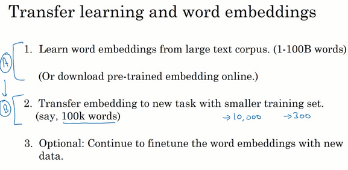
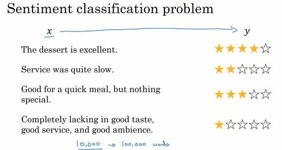
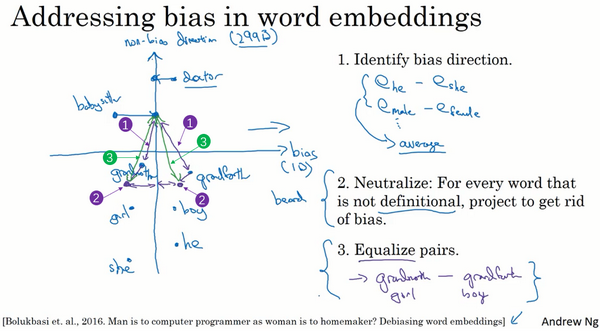

## 第二周 自然语言处理与词嵌入（Natural Language Processing and Word Embeddings）
1. 词汇表征（Word Representation）
   
   利用特征化的表示来表示每一个词，使用这种方法可以区分不同单词之间的相异之处与相似之处：

   

   使用**t-SNE算法**可以将多维数据降到二维，并进行可视化：

   

2. 使用词嵌入（Using Word Embeddings）
   
   

   用词嵌入做迁移学习
   1. 从大量的（无标签）文本集中学习词嵌入（或 下载网上预训练好的词嵌入模型）
   2. 用这些词嵌入模型把它迁移到你的新的只有少量标注训练集的任务中
   3. 当你在你新的任务上训练模型时，在你的命名实体识别任务上，只有少量的标记数据集上，你可以自己选择要不要继续微调，用新的数据调整词嵌入。
   
   当任务的**训练集相对较小**时，**词嵌入的作用最明显**，所以它**广泛用于NLP领域**；然而词嵌入在语言模型、机器翻译领域用的少一些，因为一般这些任务有大量的数据。

   与之前学的人脸编码相似，词嵌入就是学习一个固定的编码，**每一个词汇表的单词得到一个固定嵌入（编码）**
3. 词嵌入的特性（Properties of Word Embeddings）
   
   例：man如果对应woman，那么king应该对应什么？

   需要找到w让$e_{\text{man}}-e_{\text{woman}}≈ e_{\text{king}} - e_{w}$这个等式成立；为了找到对应单词**w**，应该最大化$e_{w}$与$e_{\text{king}} -  e_{\text{man}} + e_{\text{woman}}$的相似度，即
   $$Find\ word\ w:argmax \ Sim(e_{w},e_{\text{king}} - e_{\text{man}} + e_{\text{woman}})$$

   

   常用的相似度函数：余弦相似度
   $$\text{sim}\left( u,v \right) = \frac{u^{T}v}{\left| \left| u \right| \right|_{2}\left| \left| v \right| \right|_{2}}$$
4. 嵌入矩阵（Embedding Matrix）
   
   

   把矩阵$E$和指定单词的**one-hot**向量相乘，可以得到指定单词的嵌入向量$e_w$
   $$e_w= E\cdot o_w$$
   > 在实际编程时，不会用大量的矩阵和向量相乘来计算嵌入向量，因为此处矩阵向量相乘效率太低；在Keras中就有一个嵌入层，然后我们用这个嵌入层更有效地从嵌入矩阵中提取出你需要的列
5. 学习词嵌入（Learning Word Embeddings）
   
   假设在你的训练集中有这样一个更长的句子：“I want a glass of orange _____ to go along with my cereal.”。
   
   你可以先固定一个历史窗口(大小为4)，用前四个单词的嵌入向量(一个4×300维的嵌入向量)放入神经网络中，再通过softmax层预测出**目标词**("_____"处单词)

   
   
   目标词是通过一些上下文，在本例中也就是这前4个词推导出来的。如果你真想建立一个语言模型，用目标词的前几个单词作为上下文是常见做法；如果你的目标不是学习语言模型本身而是学习词嵌入，那么你可以选择其他的上下文：
   1. 目标词左右各4个词作为上下文
   2. 只提供目标词的前一个词
   3. 用**附近**的一个单词作为上下文（**Skip-Gram**）

   
6. Word2Vec
   
   我们将构造一个监督学习问题，它给定上下文词，要求你预测在这个词正负10个词距或者正负5个词距内随机选择的某个目标词；即**学习一种映射关系**，从上下文c，比如单词orange，到某个目标词，记为t。
   1. 先得到给定上下文c的嵌入向量：$e_{c}=EO_{c}$
   2. 把向量$e_{c}$喂入一个**softmax**单元，这个**softmax**单元要做的就是输出$\hat y$，$Softmax:p\left( t \middle| c \right) = \frac{e^{\theta_{t}^{T}e_{c}}}{\sum_{j = 1}^{10,000}e^{\theta_{j}^{T}e_{c}}}$（$\theta_{t}$是一个与输出$t$有关的参数，即某个词$t$和标签相符的概率是多少）
   3. 损失函数：$L\left( \hat y,y \right) = - \sum_{i = 1}^{10,000}{y_{i}\log \hat y_{i}}$
   4. 分级（hierarchical）的softmax分类器：解决上述softmax模型中计算速度过慢的问题
      - 原理：使用哈夫曼树（最优二叉树）快速找到目标词
        
        
      - 词$p(c)$的分布并不是单纯的在训练集语料库上均匀且随机的采样得到的，而是采用了不同的分级来平衡更常见的词和不那么常见的词，让**the**、**of**、**a**、**and**、**to**诸如此类不会出现得相当频繁的。

   

   Word2Vec有Skip-Gram模型版本 和 CBOW(连续词袋模型)版本。CBOW是**从原始语句推测目标字词**；而Skip-Gram正好相反，是**从目标字词推测出原始语句**。
   
   CBOW对小型数据库比较合适，而Skip-Gram在大型语料中表现更好。 
7. 负采样（Negative Sampling）
   
   负采样能做到和上面的Skip-Gram模型相似的事情，但是用了一个更加有效的学习算法。

   这个算法中要做的是构造一个新的监督学习问题，给定一对单词，比如orange和juice，我们要去预测这是否是一对上下文词-目标词.

   生成这些数据的方式是我们选择一个上下文词，再选一个目标词；在表的第一行，它给了一个**正样本**，上下文，目标词，并给定标签为1。
   
   然后我们要做的是给定$K$次（小数据集5~20，大数据集2~5），我们将用相同的上下文词，再从字典中选取随机的词，**king**、**book**、**the**、**of**等，从词典中任意选取的词，并标记0，这些就会成为**负样本**）。

   

   接下来将构造一个监督学习问题，其中学习算法输入$x$，输入这对词（编号7），要去预测目标的标签（编号8），即预测输出$y$。因此问题就是给定一对词，像**orange**和**juice**。
   
   定义一个逻辑回归模型，给定输入的$c$，$t$对的条件下，$y=1$的概率，即：

   $P\left( y = 1 \middle| c,t \right) = \sigma(\theta_{t}^{T}e_{c})$

   每次迭代我们要做的只是训练10000个其中的$K+1$个，其中$K$个负样本和1个正样本。这也是为什么这个算法计算成本更低，因为只需更新$K+1$个逻辑单元，$K+1$个二分类问题，相对而言每次迭代的成本比更新10,000维的**softmax**分类器成本低。

   选取负样本的方法，用实际观察到的英文文本的分布，用以下方式进行采样：（$f(w_{i})$是观测到的在语料库中的某个然后英文词的词频）
   
   $P\left( w_{i} \right) = \frac{f\left( w_{i} \right)^{\frac{3}{4}}}{\sum_{j = 1}^{10,000}{f\left( w_{j} \right)^{\frac{3}{4}}}}$
8. GloVe 词向量（GloVe Word Vectors）
   
   假设$X_{{ij}}$是单词$i$在单词$j$上下文中出现的次数。根据上下文和目标词的定义，你大概会得出$X_{{ij}}$等于$X_{ji}$这个结论。

   **GloVe**模型做的就是进行优化，我们将他们之间的差距进行最小化处理：

   $\text{mini}\text{mize}\sum_{i = 1}^{10,000}{\sum_{j = 1}^{10,000}{f\left( X_{{ij}} \right)\left( \theta_{i}^{T}e_{j} + b_{i} + b_{j}^{'} - logX_{{ij}} \right)^{2}}}$

   如果$X_{{ij}}$等于0的话，同时我们会用一个约定，即$0log0= 0$。
9. 情感分类（Sentiment Classification）
    
   情感分类任务就是看一段文本，然后分辨这个人是否喜欢他们在讨论的这个东西，这是NLP中最重要的模块之一。

   

   用一个**RNN**来做情感分类。首先取这条评论，"**Completely lacking in good taste, good service, and good ambiance.**"，找出每一个**one-hot**向量，这里我跳过去每一个**one-hot**向量的表示。用每一个**one-hot**向量乘以词嵌入矩阵$E$，得到词嵌入表达$e$，然后把它们送进**RNN**里。**RNN**的工作就是在最后一步计算一个特征表示，用来预测$\hat y$，这是一个**多对一**的网络结构的例子。
   
   有了这样的算法，考虑词的顺序效果就更好了，它就能意识到"**things are lacking in good taste**"，这是个负面的评价。

   
10. 词嵌入除偏（Debiasing Word Embeddings）
    
    一个已经完成学习的词嵌入可能会输出**Man**：**Computer Programmer**，同时输出**Woman**：**Homemaker**，那个结果看起来是错的，并且它执行了一个十分不良的性别歧视。

    

    如何辨别出与这个偏见相似的趋势呢？主要有以下三个步骤：
    1. 找出偏见趋势：如果某个趋势与我们想要尝试处理的特定偏见并不相关，因此这就是个无偏见趋势。在这种情况下，偏见趋势可以将它看做**1D**子空间，所以这个无偏见趋势就会是**299D**的子空间。同时相比于取平均值，如同我在这里描述的这样，实际上它会用一个更加复杂的算法叫做**SVU**。
    2. 中和步骤：所以对于那些定义不确切的词可以将其处理一下，避免偏见。有些词本质上就和性别有关，像**grandmother**、**grandfather**、**girl**、**boy**、**she**、**he**，他们的定义中本就含有性别的内容，不过也有一些词像**doctor**和**babysitter**我们想使之在性别方面是中立的。于像**doctor**和**babysitter**这种单词我们就可以将它们在这个轴上进行处理，来减少或是消除他们的性别歧视趋势的成分，也就是说**减少他们在这个水平方向上的距离**。
    3. 均衡步，意思是说你可能会有这样的词对，**grandmother**和**grandfather**，或者是**girl**和**boy**，对于这些词嵌入，你只希望性别是其区别。那为什么要那样呢？在这个例子中，**babysitter**和**grandmother**之间的距离或者说是相似度实际上是小于**babysitter**和**grandfather**之间的，因此这可能会加重不良状态，或者可能是非预期的偏见，也就是说**grandmothers**相比于**grandfathers**最终更有可能输出**babysitting**。所以在最后的均衡步中，我们想要确保的是像**grandmother**和**grandfather**这样的词都能够有一致的相似度，或者说是相等的距离，和**babysitter**或是**doctor**这样性别中立的词一样。这其中会有一些线性代数的步骤，但它主要做的就是将**grandmother**和**grandfather**移至与中间轴线等距的一对点上现在性别歧视的影响也就是这两个词与**babysitter**的距离就完全相同了。所以总体来说，会有许多对像**grandmother-grandfather**，**boy-girl**，**sorority-fraternity**，**girlhood-boyhood**，**sister-brother**，**niece-nephew**，**daughter-son**这样的词对，你可能想要通过均衡步来解决他们。