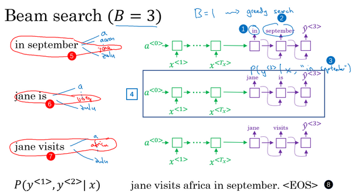
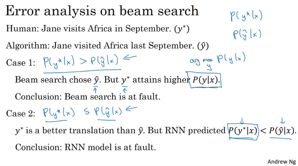
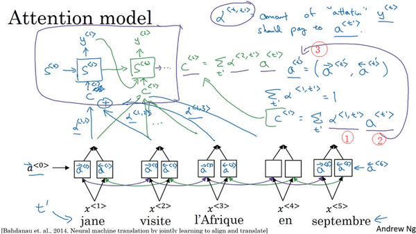
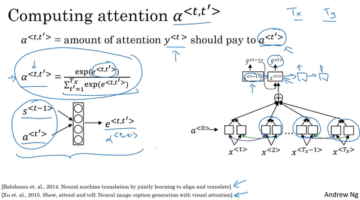
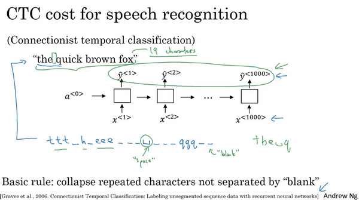
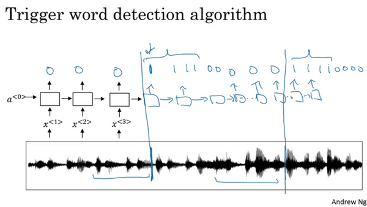

## 第三周 序列模型和注意力机制（Sequence models & Attention mechanism）
1. 基础模型
   - 机器翻译
    
     

     用RNN建立一个编码网络(encoder network)，将输入序列接收完毕后，这个RNN网络会输出一个向量来代表这个输入序列。

     之后建立一个解码网络(decoder netword)，它以编码网络的输出作为输入，之后它可以被训练为每次输出一个翻译后的单词，一直到它输出序列的结尾或者句子结尾标记。
   - 图片说明

     

     把CNN最后的softmax去掉，这部分CNN成为编码网络，后面连RNN生成图像的描述，即生成输出序列

2. 选择最可能的句子（**seq2seq机器翻译模型**）
   
   

   **seq2seq机器翻译模型**的encoder网络 总是以零向量开始进行编码，计算出一系列向量来表示输入的句子；

   decoder网络 (条件语言模型) 以encoder网络的输出作为输入，使用**束搜索算法**找到一个翻译的句子$y$，**使得条件概率最大化**，而**不是像上节的语言模型一样从得到的分布中进行随机取样**。
3. 集束搜索（Beam Search）
   
   贪婪算法：每一步挑出最优解

   集束宽：集束搜索算法的超参数，一般用符号$B$表示

   集束搜索：第n步选出前n个词最有可能的$B$个组合

   例：把法语句子 “Jane visite l'Afrique en Septembre.” 翻译成希望的英语句子 "Jane is visiting Africa in September."
   
   1. 设$B$为3，输入法语句子到编码网络，然后会解码这个网络，softmax层会输出10,000个概率值，得到这10,000个输出的概率值 $P(y^{<1>}|x)$，取**前3个**存起来。
   2. 用已经选出了in、jane、september作为第一个单词三个最可能的选择，把它们3个分别喂回来作为输入，用来评估第二个单词的概率，找到最可能的第一个和第二个单词对概率最高的3个“in September”、“jane is”、“jane visits”（$P(y^{<1>},y^{<2>}|x) = P(y^{<1>}|x)×P(y^{<2>}|y^{<1>}, x)$）
   3. 同上，得出最可能的第一个、第二个和第三个单词对概率最高的3个
      
      
   4. 集束搜索第$T_y$步的概率：$$P(y^{< 1 >}\ldots y^{< T_{y}>}|X)=P(y^{<1>}|X)\cdot P(y^{< 2 >}|X,y^{< 1 >})\cdot P(y^{< 3 >}|X,y^{< 1 >},y^{< 2>})\cdots P(y^{< T_{y} >}|X,y^{<1 >},y^{<2 >}\ldots y^{< T_{y} - 1 >})$$
   > 因为我们的集束宽等于3，每一步我们都复制3个，即有三个网络副本，这三个网络可以高效地评估下一个单词所有的30,000个选择。所以不需要初始化30,000个网络副本，只需要使用3个网络的副本就可以快速的评估**softmax**的输出，即$y^{<n+1>}$的10,000个结果。

4. 改进集束搜索（Refinements to Beam Search）
   
   
   
   由于这些概率值都是小于1的，通常远小于1，会造成数值下溢，因此在实践中,我们不会最大化这个乘积，而是取$log$值，并**最大化这个概率的$log$值**，最后挑选出在归一化的$log$概率目标函数上得分最高的一个。
   
   通过**长度归一化**，可以使得机器翻译表现的更好：
   $$\frac{1}{T_y^\alpha}\sum_{t=1}^{T_y}logP(y^{< T_{y} >}|X,y^{<1 >},y^{<2 >}\ldots y^{< T_{y} - 1 >})$$
   - $T_y$：翻译结果的单词数量
   - $\alpha$：一个超参数，一般是0.7

   相比DFS和BFS，束搜索运行的更快，但是不能保证一定能找到argmax的准确的最大值

5. 集束搜索的误差分析（Error analysis in beam search）
   
   

   $y^*$: 不错的人工翻译结果

   $\hat{y}$: 糟糕的人工翻译结果

   

   误差分析：
   1. 如果$P(y^*|x)>P(\hat{y}|x)$：在$P(y^*|x)$更大的情况下，束搜索算法却选择了$\hat y$，说明**束搜索算法出错**
   2. 如果$P(y^*|x)\leq P(\hat{y}|x)$：$P(\hat{y}|x)$更大，**RNN模型（encoder和decoder）出错**
6. 注意力模型直观理解（Attention Model Intuition）
   
   

   编码解码结构中对于短句子效果非常好，有一个相对高的Bleu分；但是对于长句子而言，比如说大于30或者40词的句子，它的表现就会变差，会看到这个有一个巨大的下倾（huge dip），**这个下倾实际上衡量了神经网络记忆一个长句子的能力，这是我们不希望神经网络去做的事情**。

   注意力模型是一部分一部分地翻译，因为记忆整个长句子是非常困难的；并且让模型只**注意到一部分的输入句子**（附近的词），不能看地太远。

   

   在注意力模型中，我们使用一个双向的RNN，为了计算每个输入单词的的特征集。以5个单词的(法语)短句子为例："Jane visite l'Afrique en Septembre"，希望生成"Jane visits Africa in September"。

   $S^{<N>}$：表示RNN的隐藏状态
   
   注意力权重$a^{<n, t>}$：当尝试去计算输出的第$n$个词时，应该花多少注意力在输入的第$m$个词上面。这些将会告诉我们，我们应该花多少注意力在记号为$C$的内容上。
   
   当生成一个特定的目标语言的词时，这允许它在每个时间步去看周围词距内的被翻译语言的词要花多少注意力。

   步骤：来到第N步 $S^{<N>}$，计算注意力权值集$a^{<N, 1>} ——\,\,a^{<N, T_x>}$，$S^{<N>}$的值取决于在$t$时（在不同的时间集）的双向RNN的激活值$a^{<t>}$和上一步的状态$S^{<N-1>}$

7. 注意力模型（Attention Model）
   
   

   1. 设有一个输入句子，并使用双向的RNN/GRU/LSTM，通过前向与后向传播去计算每个词的特征（$a^{<t>}$就是时间步$t$上的特征向量，包括前向的特征值和后向的特征值），用$t'$来索引法语句子里面的词。
   2. 接下来只进行前向计算，就是说这是个单向的**RNN**，用状态$S$表示生成翻译。所以第一个时间步，它应该生成$y^{<1>}$，当你输入上下文$C^{<1>}$，这个会取决于注意力参数，即$a^{<1,1>}$，$a^{<1,2>}$ $\cdots$，告诉我们应该花多少注意力。同样的，这个$a$参数告诉我们上下文有多少取决于我们得到的特征.
      - $\sum\limits_{t'}a^{<t,t'>}=1$
      - $c^{<t>}=\sum\limits_{t'}a^{<t,t'>}a^{<t'>}$
      > 由上述公式可知，$a^{<t,t'>}$就是$y^{<t>}$应该在$t'$时花在$a$上注意力的数量。换句话来说，**当你在$t$处生成输出词，你应该花多少注意力在第$t'$个输入词上面**，这是生成输出的其中一步。下一个时间步，你会生成第二个输出。
   3. 注意力权重由softmax生成：$a^{<t,t'>}=\displaystyle\frac{exp(e^{<t,t'>})}{\sum\limits_{t'=1}^{T_X}exp(e^{<t,t'>})}$
   
      如果你对$t'$求和，然后优先使用**softmax**，确保这些权重值加起来等于1。
   
      
   4. $e$项的计算：训练一个很小的神经网络，输入是上一时间步的隐藏状态$S^{<t-1>}$和上个时间步的的特征$a^{<t'>}$；$a^{<t,t'>}$和$e^{<t,t'>}$都取决于这两个量。最后通过反向传播算法学到一个正确的函数。
      - 缺点：这个算法的复杂是$O(n3)$的，但是在机器翻译的应用上，输入和输出的句子一般不会太长，可能三次方的消耗是可以接受。

8. 语音识别（Speech recognition）

   seq2seq模型对音频数据的应用：

   

   音频数据的常见预处理步骤，就是运行这个原始的音频片段，然后生成一个声谱图（a spectrogram），就像这样。同样地，横轴是时间，纵轴是声音的频率（frequencies），而图中不同的颜色，显示了声波能量的大小（the amount of energy），也就是在不同的时间和频率上这些声音有多大。

   在end-to-end模型中，我们发现音位表示法（phonemes representations）已经不再必要了，**而是可以构建一个系统，通过向系统中输入音频片段（audio clip），然后直接输出音频的文本（a transcript）**。

   语音识别系统的构建：

   在横轴上，也就是在输入音频的不同时间帧上，你可以用一个注意力模型，来输出文本描述，如"the quick brown fox"，或者其他语音内容。

   
   
   语音识别的其他方法：CTC损失函数（CTC cost）

   

   使用单向RNN/GRU/LSTM结构。在语音识别中，通常输入的时间步数量要比输出的时间步的数量多出很多。

   举个例子，比如你有一段10秒的音频，并且特征（features）是100赫兹的，即每秒有100个样本，于是这段10秒的音频片段就会有1000个输入，就是简单地用100赫兹乘上10秒。所以有1000个输入，但可能你的输出就没有1000个字母了，或者说没有1000个字符。

   CTC损失函数的一个基本规则是**将空白符之间的重复的字符折叠起来**：
   
   例如，ttt，这是一个特殊的字符，叫做空白符，我们这里用下划线表示，这句话开头的音可表示为h\_eee_\_\_，然后这里可能有个空格，我们用这个来表示空格，之后是\_\_\_qqq\_\_，这样的输出也被看做是正确的输出。下面这段输出对应的是"the q"。
9. 触发字检测（Trigger Word Detection）
   
   

   现在有一个这样的**RNN**结构，**我们要做的就是把一个音频片段计算出它的声谱图特征得到特征向量**$x^{<1>}$, $x^{<2>}$, $x^{<3>}$..，然后把它放到**RNN**中，最后要做的，就是定义我们的目标标签$y$。

   假如音频片段中的这一点是某人刚刚说完一个触发字，比如"Alexa"，那么在这一点之前，你就可以在训练集中把目标标签都设为0，然后在这个点之后把目标标签设为1。

   这样的标签方案对于RNN来说是可行的；不过该算法一个明显的缺点就是它构建了一个很不平衡的训练集（a very imbalanced training set），0的数量比1多太多了。

   这里还有一个解决方法，比起只在一个时间步上去输出1，其实你可以在输出变回0之前，多次输出1，或说在固定的一段时间内输出多个1。这样的话，就稍微提高了1与0的比例。