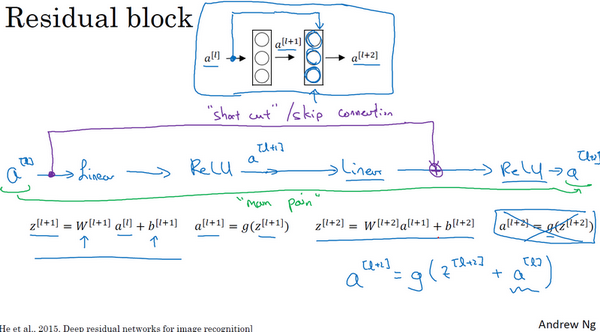
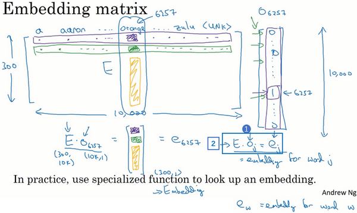

# 吴恩达DeeplearningAI总结
## 思维导图
```mermaid
graph LR
   A["深度学习"]-->AB1["符号定义"]
   A-->AB2["常见激活函数"]
      AB2-->AB2C1["Sigmoid"]
      AB2-->AB2C2["Tanh"]
      AB2-->AB2C3["Relu"]
      AB2-->AB2C4["Leaky ReLU"]
   A-->AB3["优化算法"]
      AB3-->AB3C1["SGD"]
      AB3-->AB3C2["Mini-batch SGD"]
      AB3-->AB3C3["Momentum"]
      AB3-->AB3C4["RMSprop"]
      AB3-->AB3C5["Adam"]
   A-->AB4["偏差与方差"]
   A-->AB5["正则化"]
      AB5-->AB5C1["L2正则化"]
      AB5-->AB5C2["Dropout正则化"]
   A-->AB6["归一化"]
      AB6-->AB6C1["归一化"]
      AB6-->AB6C2["Batch归一化"]
   A-->AB7["Logistic regression"]
   A-->AB8["Softmax regression"]
   A-->AB9["神经网络"]
      AB9-->AB9C1["前向传播"]
      AB9-->AB9C2["计算损失"]
      AB9-->AB9C3["反向传播"]
      AB9-->AB9C4["更新参数"]
   A-->AB10["CNN"]
      AB10-->AB10C1["CNN组成"]
         AB10C1-->AB10C1D1["CONV"]
         AB10C1-->AB10C1D2["POOL"]
         AB10C1-->AB10C1D3["FC"]
      AB10-->AB10C2["ResNets"]
      AB10-->AB10C3["经典网络"]
         AB10C3-->AB10C3D1["LeNet-5"]
         AB10C3-->AB10C3D2["AlexNet"]
         AB10C3-->AB10C3D3["VGG"]
   A-->AB11["序列模型"]
      AB11-->AB11C1["RNN"]
      AB11-->AB11C2["GRU"]
      AB11-->AB11C3["LSTM"]
      AB11-->AB11C4["BRNN"]
      AB11-->AB11C5["Deep RNNs"]
   A-->AB12["NLP"]
      AB12-->AB12C1["Word2Vec"]
      AB12-->AB12C2["Seq2Seq"]
      AB12-->AB12C3["Attention Model"]
   A-->AB13["test"]
```
## 符号定义
### 基本符号
1. $x$：表示一个$n_x$维数据，为输入数据，维度为$(n_x,1)$； 
2. $\hat{y}$：训练集的预测值
   > $\hat{y}=g{({{w}^{T}}{{x}^{(i)}}+b)}$，其中$g$是激活函数
3. $y$：训练集的实际值
4. $(x^{(i)},y^{(i)})$：表示第$i$组数据，可能是训练数据，也可能是测试数据，此处默认为训练数据；
5. $X=[x^{(1)},x^{(2)},...,x^{(m)}]$：表示所有的训练数据集的输入值，放在一个 $n_x×m$的矩阵中，其中$m$表示样本数目; 
6. $Y=[y^{(1)},y^{(2)},...,y^{(m)}]$：对应表示所有训练数据集的输出值，维度为$1×m$。
7. $w、b$：参数
8. $m$：样本数
### 神经网络符号
1.  $a^{[n]}$：第n层的激活值
2. $a^{[n]}_{i}$：第n层的第i个结点
3. $L$: 神经网络层数
4. $x = a^{[0]}$: 输入特征
5. $n^{[l]}$: 第$l$层神经元个数
6. ${w}^{[l]}、{b}^{[l]}$: 第$l$层参数
### 优化算法符号
1. $X^{\{t\}}$: 第t个mini-batch
### CNN符号
1. $f^{[l]}=filter\,size$
2. $p^{[l]}=padding$
3. $s^{[l]}=stride$
4. $n_c^{[l]}=number\,of\,filters$
5. Size of Input: $n_H^{[l-1]}×n_W^{[l-1]}×n_c^{[l-1]}$
6. Size of Output: $n_H^{[l]}×n_W^{[l]}×n_c^{[l]}$
7. Size of filter: $f^{[l]}×f^{[l]}×n_c^{[l-1]}$
8. Size of Activations: $n_H^{[l]}×n_W^{[l]}×n_c^{[l]}$
9. Size of Weights: $f^{[l]}×f^{[l]}×n_c^{[l-1]}×n_c^{[l]}$
10. Size of bias: $1×1×1×n_c^{[l]}$
11. Size of whole parameters: $(f^{[l]}×f^{[l]}×n_c^{[l-1]}+1)×n_c^{[l]}$
12. $n_H^{[l]}=⌊\frac{n_H^{[l-1]} + 2p^{[l]} - f^{[l]}}{s}+1⌋$

    $n_W^{[l]}=⌊\frac{n_W^{[l-1]} + 2p^{[l]} - f^{[l]}}{s}+1⌋$
### 序列模型符号
1. $x^{(i)<t>}$: 输入数据中 第$i$个训练样本中第$t$个元素
2. $y^{(i)<t>}$: 输出数据中 第$i$个训练样本中第$t$个元素
3. $T_{x}^{(i)}$：第$i$个训练样本的输入序列的长度
4. $T_{y}^{(i)}$：第$i$个训练样本的输出序列的长度

## 常见激活函数
1. sigmoid：
  
   - 使用场合：除了输出层是一个二分类问题基本不会用它

   <div align=center></div>

   $$g(z) = \frac{1}{1 + e^{-z}}\,\,\,\,(g(z)\in(0, 1))$$
  
2. tanh：

   - 使用场合：几乎适合所有场合
  
   <div align=center></div>

   $$g(z) = tanh(z) = \frac{e^{z} - e^{-z}}{e^{z} + e^{-z}}\,\,\,\,(g(z)\in(-1, 1))$$

3. Relu:

   - 使用场合：最常用的默认函数
  
   <div align=center></div>

   $$g(z) =max (0,z)$$

4. Leaky ReLU:
   
   <div align=center></div>
   
   $$g(z)=\max(0.01z,z)$$

## 优化算法
1. 梯度下降（批量梯度下降）
   
   
   > $J(w,b)$是一个凸函数(**convex function**)
   1. 初始化
   2. 朝最陡的下坡方向走一步，不断地迭代
      1. $:=$表示更新参数
      2. $a$ 表示学习率（**learning rate**），用来控制步长（**step**），即向下走一步的长度
      3. 不断重复下列操作：
         1. $w:=w-\alpha{\frac{\partial J(w,b)}{\partial w}}$
         2. $b:=b-\alpha{\frac{\partial J(w,b)}{\partial b}}$
   3. 直到走到全局最优解或者接近全局最优解的地方
2. Mini-batch 梯度下降：
   1. 定义：把训练集分割为小一点的子集训练，这些子集叫**Mini-batch**
     
     使用batch梯度下降法，一次遍历训练集只能让你做一个梯度下降，使用mini-batch梯度下降法，一次遍历训练集，能让你做$\frac{m}{m_{mini}}$个梯度下降
     > 若$m_{mini}=1$，被称为**随机梯度下降法(SGD)**
   2. **使用mini-batch梯度下降法，如果你作出成本函数在整个过程中的图，则并不是每次迭代都是下降的，会有噪音**，这是因为也许$X^{\{1\}}$和$Y^{\{1\}}$是比较容易计算的**mini-batch**，因此成本会低一些。不过也许出于偶然，$X^{\{2\}}$和$Y^{\{2\}}$是比较难运算的**mini-batch**，或许需要一些残缺的样本，这样一来，成本会更高一些，所以才会出现这些摆动。
   
   3. 实践中最好选择不大不小的mini-batch尺寸，因为
      1. 得到了大量向量化，比一次性处理多个样本快得多
      2. 不需要等待整个训练集被处理完就可以开始进行后续工作，加快训练速度
   4. **mini-batch**的大小选择：
      1. 当$m>2000$，使用batch梯度下降法
      2. 一般mini-batch大小是$2^n$，64到512的mini-batch大小比较常见。
   5. 具体步骤：
      - Shuffle：如下所示，创建训练集（X，Y）的随机打乱版本。X和Y中的每一列代表一个训练示例。注意，随机打乱是在X和Y之间同步完成的。这样，在随机打乱之后，X的列就是对应于Y中标签的示例。打乱步骤可确保该示例将随机分为不同小批。
        
        ```py
         # Step 1: Shuffle (X, Y)
         permutation = list(np.random.permutation(m))
         shuffled_X = X[:, permutation]
         shuffled_Y = Y[:, permutation].reshape((1,m))
        ```
      - Partition：将打乱后的（X，Y）划分为大小为mini_batch_size（此处为64）的小批处理。请注意，训练示例的数量并不总是可以被mini_batch_size整除。最后的小批量可能较小，但是你不必担心，当最终的迷你批处理小于完整的mini_batch_size时，它将如下图所示：
        
        ```py
         # Step 2: Partition (shuffled_X, shuffled_Y). Minus the end case.
         num_complete_minibatches = math.floor(m/mini_batch_size) # number of mini batches of size mini_batch_size in your partitionning
         for k in range(0, num_complete_minibatches):
            ### START CODE HERE ### (approx. 2 lines)
            mini_batch_X = shuffled_X[:, k * mini_batch_size : (k+1) * mini_batch_size]
            mini_batch_Y = shuffled_Y[:, k * mini_batch_size : (k+1) * mini_batch_size]
            ### END CODE HERE ###
            mini_batch = (mini_batch_X, mini_batch_Y)
            mini_batches.append(mini_batch)

         # Handling the end case (last mini-batch < mini_batch_size)
         if m % mini_batch_size != 0:
            ### START CODE HERE ### (approx. 2 lines)
            mini_batch_X = shuffled_X[:, num_complete_minibatches * mini_batch_size : m]
            mini_batch_Y = shuffled_Y[:, num_complete_minibatches * mini_batch_size : m]
            ### END CODE HERE ###
            mini_batch = (mini_batch_X, mini_batch_Y)
            mini_batches.append(mini_batch)
        ```
3. 动量梯度下降法(Momentum)
   
   

   如图所示，在梯度下降时，会发生摆动；在纵轴上，你希望学习慢一点，因为你不想要这些摆动，但是在横轴上，你希望加快学习，你希望快速从左向右移，移向最小值，移向红点，这时可以用到动量梯度下降法，**来抵消纵向的摇摆**：
   $$v_{dW} = \beta v_{{dW}} + ( 1 - \beta)dW$$
   $$v_{db} = \beta v_{{db}} + ( 1 - \beta)db$$
   $$W:= W -\alpha v_{dW}$$
   $$b:= b -\alpha v_{db}$$
   $$Hyperparameters:\alpha,\beta\,\,\,\,\,\,(\beta = 0.9)$$
4. RMSprop

   加快梯度下降也可以用RMSprop算法

   假设纵轴代表参数$b$，横轴代表参数$W$，所以，你想减缓$b$方向的学习，即纵轴方向，同时加快横轴方向的学习，RMSprop算法可以实现这一点

   $\epsilon$是很小的数字，避免被零除

   
   $$S_{dW} = \beta S_{dW} + ( 1 - \beta )dW^2$$
   $$S_{db} = \beta S_{db} + ( 1 - \beta){db}^2$$
   $$W:= W -\alpha \frac{dW}{\sqrt{S_{dW}}+\epsilon}$$
   $$b:= b -\alpha \frac{db}{\sqrt{S_{db}}+\epsilon}$$
   $$Hyperparameters:\alpha,\beta,\epsilon\,\,\,\,\,\,(\beta = 0.999,\epsilon=10^{-8})$$
5. Adam优化算法
   
   **Adam**优化算法基本上就是将**Momentum**和**RMSprop**结合在一起:
   1. 计算过去梯度的指数加权平均值，并将其存储在变量（使用偏差校正之前）和 （使用偏差校正）中。
   2. 计算过去梯度的平方的指数加权平均值，并将其存储在变量（偏差校正之前）和（偏差校正中）中。
   3. 组合“i”和“ii”的信息，在一个方向上更新参数。

   On iteration t:
   $$v_{dW} = 0，S_{dW} =0，v_{db} = 0，S_{db} =0$$

   $$v_{dW} = \beta_1 v_{{dW}} + (1 - \beta_1)dW$$

   $$v_{db} = \beta_1 v_{{db}} + (1 - \beta_1)db$$

   $$S_{dW} = \beta_2 S_{dW} + (1 - \beta_2)dW^2$$

   $$S_{db} = \beta_2 S_{db} + (1 - \beta_2)db^2$$

   $$v^{corrected}_{dW} = \frac{v_{dW}}{1-\beta_1^t}$$

   $$v^{corrected}_{db} = \frac{v_{db}}{1-\beta_1^t}$$

   $$S^{corrected}_{dW} = \frac{S_{dW}}{1-\beta_2^t}$$

   $$S^{corrected}_{db} = \frac{S_{db}}{1-\beta_2^t}$$

   $$W:= W -\alpha \frac{v^{corrected}_{dW}}{\sqrt{S^{corrected}_{dW}}+\epsilon}$$

   $$b:= b -\alpha \frac{v^{corrected}_{db}}{\sqrt{S^{corrected}_{db}}+\epsilon}$$

   Hyperparameters:
   1. $\alpha$: needs to be tuned
   2. $\beta_1$: 0.9
   3. $\beta_2$: 0.999
   4. $\epsilon$: $10^{-8}$

## 偏差与方差
1. 偏差，方差（Bias/Variance）
   
   
   - High Bias: 上左，接近线性，欠拟合(数据拟合度低)
   - High Variance: 上右，过度拟合

   
   - High Bias: 训练集误差高(欠拟合)
   - High Variance: 验证集误差 远高于 训练集误差(过度拟合)
2. 偏差与方差过高的解决方法

   
   - The revolution of **High Bias**:
     1. Pick a network having more layers or more units
     2. Train longer
     3. Find a more appropriate nerual network architecture
   - The revolution of **High Variance**:
     1. More data
     2. Regularization
     3. Find a more appropriate nerual network architecture

## 正则化（Regularization）
1. L2正则化
   1. 正则化参数：$\lambda$
   2. 弗罗贝尼乌斯范数（Forbenius form \ L2 form）:
      $$||w||_F^2=\sum\limits_{i=1}^{n^{[l]}}\sum\limits_{j=1}^{n^{[l-1]}}(w_{ij}^{[l]})^2$$
   3. 逻辑回归函数中加入正则化:
      $$J = -\frac{1}{m} \sum\limits_{i = 1}^{m} (y^{(i)}\log\left(a^{[L] (i)}\right) + (1-y^{(i)})\log\left(1- a^{[L](i)}\right)) +\frac{\lambda}{2m}||w||_F^2$$
      ```py
      L2_regularization_cost = lambd/(2*m)*(np.sum(np.square(W1)) + np.sum(np.square(W2)) + np.sum(np.square(W3)) + ...)
      cost = cross_entropy_cost + L2_regularization_cost
      ```
   4. 梯度下降：
      $$dW^{[l]}=(from backprop)+\frac{\lambda}{m}W^{[l]}$$
      ```py
      dW = 1./m * np.dot(dZ, A_prev.T) + lambd/m * W
      ```
      $$W^{[l]}:=(1-\alpha\frac{\lambda}{m})W^{[l]}-\alpha(from backprop)$$
      > L2正则化也被称为权重衰减
2. Dropout正则化
   
   Dropout(随机失活): 在网络中的每一层，为每个节点设置概率；设置完节点概率，我们会消除一些节点，然后删除掉从该节点进出的连线，最后得到一个节点更少，规模更小的网络，然后用backprop方法进行训练。
   
   
   
   

   这是网络节点精简后的一个样本，对于其它样本，我们照旧以抛硬币的方式设置概率，保留一类节点集合，删除其它类型的节点集合。**对于每个训练样本，我们都将采用一个精简后神经网络来训练它**

   **inverted dropout**（反向随机失活）：
   1. 定义向量$d$，$d^{[3]}$表示网络第三层的**dropout**向量
      ```py
      d3 = np.random.rand(a3.shape[0],a3.shape[1])
      ```
      在**python**中，$d^{[3]}$则是一个布尔型数组
   2. 设置keep_prob(保留隐藏单元概率)
      ```py
      d3 = (d3 < keep_prob)
      ```
      $d^{[3]}$是一个矩阵，每个样本和每个隐藏单元，其中$d^{[3]}$中的对应值为1的概率都是keep_prob，对应为0的概率是1 - keep_prob
   3. 处理激活函数
      ```py
      a3 = a3 * d3
      ```
      乘法运算最终把$d^{\left\lbrack3 \right]}$中相应元素输出，即让$d^{[3]}$中0元素与$a^{[3]}$中相对元素归零
   4. 向外扩展$a^{[3]}$
      ```py
      a3 = a3 / keep_prob
      ```
   > 在测试阶段不使用dropout函数

   对Dropout的解释：
   
   不于任何一个特征，因为该单元的输入可能随时被清除，因此该单元通过这种方式传播下去，并为单元的四个输入增加一点权重，通过传播所有权重，**dropout将产生收缩权重的平方范数的效果，并完成一些预防过拟合的外层正则化**，和L2正则化类似

   不同层的keep_prob也可以变化

   keep_prob=1，意味着保留所有单元

## 归一化
1. 归一化输入(Normalizing inputs)
   
   假设一个训练集有两个特征，输入特征为2维，归一化需要两个步骤：
   1. 零均值
      1. $\mu = \frac{1}{m}\sum\limits_{i =1}^{m}x^{(i)}$
      2. $x:=x-\mu$
   2. 归一化方差；
      1. $\sigma^{2}= \frac{1}{m}\sum\limits_{i =1}^{m}(x^{(i)})^{2}$
      2. $x/=\sigma^2$

   

   归一化后，数据就都为均值为0，方差为1的正态分布了
   > 归一化作用：使代价函数$J$更快地进行优化
2. Batch归一化 (Batch Norm)
   > Batch归一化会使你的参数搜索问题变得很容易，使神经网络对超参数的选择更加稳定，超参数的范围会更加庞大，工作效果也很好，也会是你的训练更加容易，甚至是深层网络。
   - 公式：
   
   $$\mu = \frac{1}{m}\sum_iz^{(i)}$$
   $$\sigma^2 = \frac{1}{m}\sum_i(z^{(i)}-\mu)^2$$
   $$z_{norm}^{(i)} = \frac{z^{(i)}-\mu}{\sqrt{\sigma^2+\epsilon}}$$
   $$\tilde{z}^{(i)} = \gamma z_{norm}^{(i)}+\beta$$
   - 作用：它适用的归一化过程，不只是输入层，甚至同样适用于神经网络中的深度隐藏层
   - 通过赋予$\gamma$和$\beta$值，可以构造含指定平均值和方差的隐藏单元值；如果$\gamma= \sqrt{\sigma^{2} +\varepsilon}$，$\beta = \mu$，则${\tilde{z}}^{(i)} = z^{(i)}$，即$\tilde{z}^{(i)}$还是正态分布$(\mu=0, \sigma^2=1)$
   - $\gamma$和$\beta$的维数：($n^{[l]},1$)

   - 如何用**Batch**归一化来应用梯度下降法:

     for $t=1$ to **num MiniBatch**
     
        1. 在$X^{\left\{ t\right\}}$上计算正向**prop**，每个隐藏层都应用正向**prop**，用**Batch**归一化代替$z^{[l]}$为${\tilde{z}}^{[l]}$。
        2. 用反向**prop**计算$dw^{[l]}$和$db^{[l]}$，$d{\beta}^{[l]}$和$d\gamma^{[l]}$。
        3. 更新这些参数：$w^{[l]} = w^{[l]} -\text{αd}w^{[l]}$，和以前一样，${\beta}^{[l]} = {\beta}^{[l]} - {αd}{\beta}^{[l]}$，对于$\gamma$也是如此$\gamma^{[l]} = \gamma^{[l]} -{αd}\gamma^{[l]}$。（也可以用momentum，RMSpop，Adam等算法）
     
   - 原理：
     1. 对于这里的输入值，和隐藏单元的值归一化，以此来加速学习
     2. 它减弱了前层参数的作用与后层参数的作用之间的联系，它使得网络每层都可以自己学习，稍稍独立于其它层，这有助于加速整个网络的学习。
     3. 有轻微的正则化效果(Batch Norm的副作用)，min-batch的数量越大，正则化效果越弱

## Logistic regression（逻辑回归）
Logistic regression(逻辑回归)：一个用于二分类(**binary classification**)的算法
1. Loss function（对数似然函数）：$$L\left( \hat{y},y \right)=-y\log(\hat{y})-(1-y)\log (1-\hat{y})$$损失函数衡量算法在单个训练样本中表现，**通过训练改变参数$w、b$进而改变预测值$\hat{y}$，让损失函数的值越小越好**
2. Cost function（最大似然估计）:$$J\left( w,b \right)=\frac{1}{m}\sum\limits_{i=1}^{m}{L\left( {{{\hat{y}}}^{(i)}},{{y}^{(i)}} \right)}=\frac{1}{m}\sum\limits_{i=1}^{m}{\left( -{{y}^{(i)}}\log {{{\hat{y}}}^{(i)}}-(1-{{y}^{(i)}})\log (1-{{{\hat{y}}}^{(i)}}) \right)}$$代价函数衡量算法在全部训练样本上的表现；通过训练代价函数最终得到参数$w$和参数$b$

## Softmax regression
Softmax regression：一个用于多分类的算法


1. Output function：$\hat{y}=g{{({{w}^{T}}{{x}^{(i)}}+b)}}$, where $g{(z)} = \frac{e^{(z)}}{\sum_{j=1}^{C}e^{(z)}_j}$
2. Loss function：$L(\hat y,y ) = - \sum_{j = 1}^{C}{y_{j}log\hat y_{j}}$
3. Cost function：$J( w^{[1]},b^{[1]},\ldots\ldots) = \frac{1}{m}\sum_{i = 1}^{m}{L( \hat y^{(i)},y^{(i)})}$
4. Backward propagation：$dz^{[l]} = \hat{y} -y$
5. 例：

   

   

## 神经网络


1. 神经网络的表示
   1. **输入层**：包含了神经网络的输入
   2. **隐藏层**：在训练集中，无法得知中间结点准确值的层级
   3. **输出层**：负责产生预测值
2. 矩阵的维数
   1. ${{W}^{[l]}}$: $({{n}^{[l]}}$,${{n}^{[l-1]}})$；
   2. ${{b}^{[l]}}$ : $({{n}^{[l]}},1)$
   3. ${Z}^{[l]}、{A}^{[l]}$：$({n}^{[l]},m)$
3. 隐藏层公式：
   
   $$
   \left[
         \begin{array}{c}
         z^{[1]}_{1}\\
         z^{[1]}_{2}\\
         z^{[1]}_{3}\\
         z^{[1]}_{4}\\
         \end{array}
         \right]
         =
      \overbrace{
      \left[
         \begin{array}{c}
         ...W^{[1]T}_{1}...\\
         ...W^{[1]T}_{2}...\\
         ...W^{[1]T}_{3}...\\
         ...W^{[1]T}_{4}...
         \end{array}
         \right]
         }^{W^{[1]}}
         *
      \overbrace{
      \left[
         \begin{array}{c}
         x_1\\
         x_2\\
         x_3\\
         \end{array}
         \right]
         }^{input}
         +
      \overbrace{
      \left[
         \begin{array}{c}
         b^{[1]}_1\\
         b^{[1]}_2\\
         b^{[1]}_3\\
         b^{[1]}_4\\
         \end{array}
         \right]
         }^{b^{[1]}}
   $$
   $$
   a^{[1]} =
      \left[
         \begin{array}{c}
         a^{[1]}_{1}\\
         a^{[1]}_{2}\\
         a^{[1]}_{3}\\
         a^{[1]}_{4}
         \end{array}
         \right]
         = \sigma(z^{[1]})
   $$
   
4. 多样本向量化
   $$
   x =
      \left[
         \begin{array}{c}
         \vdots & \vdots & \vdots & \vdots\\
         x^{(1)} & x^{(2)} & \cdots & x^{(m)}\\
         \vdots & \vdots & \vdots & \vdots\\
         \end{array}
         \right]
   $$
   $$
   Z^{[1]} =
      \left[
         \begin{array}{c}
         \vdots & \vdots & \vdots & \vdots\\
         z^{[1](1)} & z^{[1](2)} & \cdots & z^{[1](m)}\\
         \vdots & \vdots & \vdots & \vdots\\
         \end{array}
         \right]
   $$
   $$
   A^{[1]} =
      \left[
         \begin{array}{c}
         \vdots & \vdots & \vdots & \vdots\\
         \alpha^{[1](1)} & \alpha^{[1](2)} & \cdots & \alpha^{[1](m)}\\
         \vdots & \vdots & \vdots & \vdots\\
         \end{array}
         \right]
   $$
   $$
         \begin{cases}
         \text{$Z^{[1]} = W^{[1]}X+b^{[1]}$}\\
         \text{$A^{[1]} = \sigma(z^{[1]})$}\\
         \text{$Z^{[2]} = W^{[2]}A^{[1]} + b^{[2]}$}\\ 
         \text{$A^{[2]} = \sigma(z^{[2]})$}\\ 
         \end{cases}
   $$
5. 参数VS超参数
   1. Parameters: $W^{[1]}、b^{[1]}、W^{[2]}、b^{[2]}\cdots$
   2. Hyperparameters: 
      - **learning rate** $a$（学习率）
      - **iterations**(梯度下降法循环的数量)
      - $L$（隐藏层数目）
      - $n^{[l]}$（隐藏层单元数目）
      - **choice of activation function**（激活函数的选择）
      - $\cdots\,\cdots$
6. 神经网络的权重初始化
    > 神经网络的权重初始化可以降低梯度消失和爆炸问题

    1. 为了设置$Var(w_{i})=\frac{1}{n}$，应设置某层权重矩阵$$w^{[l]} = np.random.randn( \text{shape})*\text{np.}\text{sqrt}(\frac{1}{n^{[l-1]}})$$
    2. 当用的是**Relu**激活函数，标准差设置为$\sqrt{\frac{2}{n^{[l-1]}}}$，即$\text{np.}\text{sqrt}(\frac{2}{n^{[l-1]}})$
    3. 当用的是**tanh**激活函数，标准差设置为$\sqrt{\frac{1}{n^{[l-1]}}}$或$\sqrt{\frac{2}{n^{[l-1]} + n^{\left[l\right]}}}$
## CNN
1. 典型的卷积神经网络：
   1. Convolution(CONV，卷积层)
   2. Pooling(POOL，池化层)
   3. Fully Connected(FC，全连接层)

   

   **随着神经网络计算深度不断加深，高度和宽度会随着网络深度的加深而逐渐减小；而通道数量会随着网络深度的加深而增加。**
2. 卷积
   
   

   输出维度：$⌊\displaystyle\frac{n + 2p - f}{s}+1⌋×⌊\frac{n + 2p - f}{s}+1⌋$，其中$⌊\,\,⌋$这是向下取整的符号
   > n: input矩阵边长
   > 
   > f: filter矩阵边长
   > 
   > p: padding大小
   > 
   > s: 步长

   - Same卷积：填充后，你的输出大小和输入大小是一样的，此时$p=(f-1)/2$
   - Valid卷积：不填充，即$p=0$
3. 单层卷积网络 (CONV)
   
   

   Forward propagation：
   1. $z^{[l]}=W^{[l]}a^{[l]}+b^{[l]}$
   2. $a^{[l]}=g(z^{[l]})$
4. 池化层 (POOL)
   
   
   
   Hyperparameters：
   1. f: filter size
   2. s: stride
   3. max or average of pooling
   
   最大池化只是计算神经网络某一层的静态属性，没有什么需要学习的。因此执行反向传播时，反向传播没有参数适用于最大池化。

   $n_H^{[l]}=⌊\frac{n_H^{[l-1]} - f^{[l]}}{s}+1⌋$

   $n_W^{[l]}=⌊\frac{n_W^{[l-1]} - f^{[l]}}{s}+1⌋$
5. 神经网络常见模式：
   1. 几个卷积层+池化层->(flatten->)几个全连接层->一个softmax
   2. 一个或多个卷积层->一个池化层->(flatten->)几个全连接层->一个softmax
   > 进入全连接层之前需要先将输入展开(flatten)

   
6. 卷积的优点：
   1. 参数共享：特征检测如垂直边缘检测如果适用于图片的某个区域，那么它也可能适用于图片的其他区域。
   2. 稀疏连接：在每层中，每个输出值仅仅依靠一小部分的输入
7. 残差网络 (ResNets)
   
   作用：解决梯度消失和梯度爆炸问题

   跳跃连接（**Skip connection**）：**ResNets**是由残差块（**Residual block**）构建的，即让$a_{[l]}$进行前向反馈进入第二个RELU函数，即：$\ a^{\left\lbrack l + 2 \right\rbrack} = g\left(z^{\left\lbrack l + 2 \right\rbrack} + a^{[l]}\right)$，也就是加上的这个$a^{[l]}$产生了一个残差块。

   

   如果输入和输出有不同维度，比如输入的维度是128，$a^{\left\lbrack l + 2\right\rbrack}$的维度是256，再增加一个矩阵，这里标记为$W_{s}$，$W_{s}$是一个256×128维度的矩阵，所以$W_{s}a^{\left\lbrack l\right\rbrack}$的维度是256，这个新增项是256维度的向量。你不需要对$W_{s}$做任何操作，它是网络通过学习得到的矩阵或参数，它是一个固定矩阵，**padding**值为0，用0填充$a^{[l]}$，其维度为256，所以者几个表达式都可以。

   

   作用：对于一个普通网络，随着网络深度的加深，training error会越来越多；而对于ResNets，即使网络再深，训练的表现仍然不错

   
8. 经典网络
   1. LeNet-5
   2. AlexNet
   3. VGG
## 序列模型 (Sequence Models)
1. RNN
   - $W_{aa}$: 表示管理着从$x^{<t>}$到隐藏层的连接的一系列参数
   - $W_{ax}$: 决定激活值 (水平) 联系
   - $W_{ya}$: 表示管理着从隐藏层到$y^{<t>}$的连接的一系列参数
   - $W_a$: $[ {{W}_{aa}}\vdots {{W}_{ax}}]$
   - $W_y$: $W_{ya}$
   - Forward Propagation:
  
   
   
   公式：
     $$a^{<t>} =g(W_{a}\left\lbrack a^{< t-1 >},x^{<t>} \right\rbrack +b_{a})$$
     > $W_{a}\left\lbrack a^{< t-1 >},x^{<t>} \right\rbrack = [ {{W}_{aa}}\vdots {{W}_{ax}}]×\begin{bmatrix} a^{< t - 1 >} \\ x^{< t >} \\ \end{bmatrix}$
     $$\hat y^{< t >} = g(W_{y}a^{< t >} +b_{y})$$
   
   损失函数: 
   1. 元素$t$的损失函数: $$L^{<t>}( \hat y^{<t>},y^{<t>}) = - y^{<t>}\log\hat  y^{<t>}-( 1- y^{<t>})log(1-\hat y^{<t>})$$
   2. 整个序列的损失函数: $$L(\hat y,y) = \ \sum_{t = 1}^{T_{x}}{L^{< t >}(\hat  y^{< t >},y^{< t >})}$$
2. 语言模型和序列生成（Language model and sequence generation）
   > \<EOS>: 标记句子结尾

   语言模型(如生成指定风格的文本)：告诉你某个特定的句子它出现的概率大小

   如何建立一个语言模型:
   1. 对训练集内的文本完成标识化
      - 建立一个字典，然后将每个单词都转换成对应的one-hot向量
   2. 构建一个RNN来构建这些序列的概率模型
      - 将$x^{<0>}$设为$\vec{0}$
      - 用$x^{<1>}$激活$a^{<0>}(=\vec{0})$
      - $a^{<1>}$会通过**softmax**进行一些预测来计算出第一个词可能会是什么（字典中的任意单词会是第一个词的概率）
      - 在第N个时间步，$x^{<n>} = y^{<n-1>}$，即把前n个预测出的单词告诉它，然后计算出字典中的任意单词会是第N个词的概率
   
   
3. **GRU**单元（Gated Recurrent Unit（**GRU**））
   
   GRU优点：
   1. 改变了RNN的隐藏层，使其可以更好地捕捉深层连接
   2. 改善了梯度消失问题
   
   

   符号：
   3. $c^{<t>}$: 记忆细胞，$c^{<t>} = a^{<t>}$，用来记忆之前的单词
   4. ${\tilde{c}}^{<t>}$: 记忆细胞候选值，${\tilde{c}}^{<t>} =tanh(W_{c}\left\lbrack c^{<t-1>},x^{<t>} \right\rbrack +b_{c})$，使用更新门$\Gamma_{u}$来决定是否要用${\tilde{c}}^{<t>}$ 更新$c^{<t>}$
   5. $\Gamma_{u}$: 更新门，范围0~1，用来决定是否要更新$c^{<t>}$
   6. $\Gamma_{r}$: 相关门，范围0~1，用来计算出的下一个$c^{<t>}$的候选值${\tilde{c}}^{<t>}$跟$c^{<t-1>}$有多大的相关性

   公式：

   $${\tilde{c}}^{<t>}=tanh(W_c[\Gamma_{r}*c^{<t-1>},x^{<t>}]+b_c)$$

   $$\Gamma_{u}= \sigma(W_{u}\left\lbrack c^{<t-1>},x^{<t>} \right\rbrack + b_{u})$$

   $$\Gamma_{r}= \sigma(W_{r}\left\lbrack c^{<t-1>},x^{<t>} \right\rbrack + b_{r})$$

   $$c^{<t>}=\Gamma_{u}*{\tilde{c}}^{<t>}+(1-\Gamma_{u})+{\tilde{c}}^{<t-1>}$$

   $$a^{<t>} = c^{<t>}$$
4. 长短期记忆（**LSTM**（long short term memory）
    
    LSTM是一个比GRU更加强大和通用的版本

    符号：
    1. $\Gamma_{f}$: 遗忘门，使用单独的更新门$\Gamma_{u}$和遗忘门$\Gamma_{f}$去维持旧的值$c^{<t-1>}$或者就加上新的值${\tilde{c}}^{<t>}$
    2. $\Gamma_{o}$: 输出门

    

    公式：
    $${\tilde{c}}^{<t>}=tanh(W_c[c^{<t-1>},x^{<t>}]+b_c)$$

    $$\Gamma_{u}= \sigma(W_{u}\left\lbrack c^{<t-1>},x^{<t>} \right\rbrack + b_{u})$$

    $$\Gamma_{f}= \sigma(W_{f}\left\lbrack c^{<t-1>},x^{<t>} \right\rbrack + b_{f})$$

    $$\Gamma_{o}= \sigma(W_{o}\left\lbrack c^{<t-1>},x^{<t>} \right\rbrack + b_{o})$$

    $$c^{<t>}=\Gamma_{u}*{\tilde{c}}^{<t>}+\Gamma_{f}+{\tilde{c}}^{<t-1>}$$

    $$a^{<t>} = \Gamma_{o}*tanh(c^{<t>})$$

    GRU的优点是这是个更加简单的模型，所以更容易创建一个更大的网络，而且它只有两个门，**在计算性上也运行得更快**，然后它可以扩大模型的规模。

    LSTM更加**强大和灵活**，因为它有三个门而不是两个。
5. 双向循环神经网络（Bidirectional **RNN**）
    
    符号：
    1. ${\overrightarrow{a}}^{<n>}$：前向循环单元
    2. ${\overleftarrow{a}}^{<n>}$：反向循环单元

    过程：
    3. 给定一个输入序列$x^{<1>}$到$x^{<4>}$
    4. 依次计算前向循环单元${\overrightarrow{a}}^{<1>}\cdots{\overrightarrow{a}}^{<4>}$
    5. 依次计算反向循环单元${\overleftarrow{a}}^{<4>}\cdots{\overleftarrow{a}}^{<1>}$
    6. 计算预测值 $\hat y^{<t>} =g(W_{g}\left\lbrack {\overrightarrow{a}}^{< t >},{\overleftarrow{a}}^{< t >} \right\rbrack +b_{y})$

    

    双向**RNN**不仅能用于基本的**RNN**结构，也能用于**GRU**和**LSTM**。
6. 深层循环神经网络（Deep **RNN**s）

    

    与普通的深层神经网络相似，深层RNN也是堆叠隐藏层，只是需要**按时间展开**。

    由于时间的维度，RNN网络会变得相当大，即使只有很少的几层。所以对于RNN来说，有三层就已经不少了。

    可以在RNN上面再堆叠(不水平连接的)循环层，用来预测$y^{<t>}$

    通常这些单元没必要非是标准的RNN，最简单的RNN模型，也可以是GRU单元或者LSTM单元

## NLP
1. 嵌入矩阵（Embedding Matrix）
   
   

   把特征矩阵$E$和指定单词的**one-hot**向量相乘，可以得到指定单词的嵌入向量$e_w$
   $$e_w= E\cdot o_w$$
2. Word2Vec
   
   我们将构造一个监督学习问题，它给定上下文词，要求你预测在这个词正负10个词距或者正负5个词距内随机选择的某个目标词；即**学习一种映射关系**，从上下文c，比如单词orange，到某个目标词，记为t。
   1. 先得到给定上下文c的嵌入向量：$e_{c}=EO_{c}$
   2. 把向量$e_{c}$喂入一个**softmax**单元，这个**softmax**单元要做的就是输出$\hat y$，$Softmax:p\left( t \middle| c \right) = \frac{e^{\theta_{t}^{T}e_{c}}}{\sum_{j = 1}^{10,000}e^{\theta_{j}^{T}e_{c}}}$（$\theta_{t}$是一个与输出$t$有关的参数，即某个词$t$和标签相符的概率是多少）
   3. 损失函数：$L\left( \hat y,y \right) = - \sum_{i = 1}^{10,000}{y_{i}\log \hat y_{i}}$
   4. 分级（hierarchical）的softmax分类器：解决上述softmax模型中计算速度过慢的问题
      - 原理：使用哈夫曼树（最优二叉树）快速找到目标词
        
        
      - 词$p(c)$的分布并不是单纯的在训练集语料库上均匀且随机的采样得到的，而是采用了不同的分级来平衡更常见的词和不那么常见的词，让**the**、**of**、**a**、**and**、**to**诸如此类不会出现得相当频繁的。

   
3. seq2seq
   
   

   用RNN建立一个**编码网络(encoder network)**，是以零向量开始进行编码，将输入序列接收完毕后，这个RNN网络会输出一个向量来代表这个输入序列。

   之后建立一个**解码网络(decoder netword)**，它以编码网络的输出作为输入，使用**束搜索算法**找到一个翻译的句子$y$，**使得条件概率最大化**，而**不是像上节的语言模型一样从得到的分布中进行随机取样**。

   集束搜索（Beam Search）：第n步选出前n个词最有可能的$B$ (集束宽)个组合

   集束搜索第$T_y$步的概率：$$P(y^{< 1 >}\ldots y^{< T_{y}>}|X)=P(y^{<1>}|X)\cdot P(y^{< 2 >}|X,y^{< 1 >})\cdot P(y^{< 3 >}|X,y^{< 1 >},y^{< 2>})\cdots P(y^{< T_{y} >}|X,y^{<1 >},y^{<2 >}\ldots y^{< T_{y} - 1 >})$$

4. Attention Model（注意力模型）
   
   

   1. 设有一个输入句子，并使用双向的RNN/GRU/LSTM，通过前向与后向传播去计算每个词的特征（$a^{<t>}$就是时间步$t$上的特征向量，包括前向的特征值和后向的特征值），用$t'$来索引法语句子里面的词。
   2. 接下来只进行前向计算，就是说这是个单向的**RNN**，用状态$S$表示生成翻译。所以第一个时间步，它应该生成$y^{<1>}$，当你输入上下文$C^{<1>}$，这个会取决于注意力参数，即$a^{<1,1>}$，$a^{<1,2>}$ $\cdots$，告诉我们应该花多少注意力。同样的，这个$a$参数告诉我们上下文有多少取决于我们得到的特征.
      - $\sum\limits_{t'}a^{<t,t'>}=1$
      - $c^{<t>}=\sum\limits_{t'}a^{<t,t'>}a^{<t'>}$
      > 由上述公式可知，$a^{<t,t'>}$就是$y^{<t>}$应该在$t'$时花在$a$上注意力的数量。换句话来说，**当你在$t$处生成输出词，你应该花多少注意力在第$t'$个输入词上面**，这是生成输出的其中一步。下一个时间步，你会生成第二个输出。
   3. 注意力权重由softmax生成：$a^{<t,t'>}=\displaystyle\frac{exp(e^{<t,t'>})}{\sum\limits_{t'=1}^{T_X}exp(e^{<t,t'>})}$
   
      如果你对$t'$求和，然后优先使用**softmax**，确保这些权重值加起来等于1。
   
      
   4. $e$项的计算：训练一个很小的神经网络，输入是上一时间步的隐藏状态$S^{<t-1>}$和上个时间步的的特征$a^{<t'>}$；$a^{<t,t'>}$和$e^{<t,t'>}$都取决于这两个量。最后通过反向传播算法学到一个正确的函数。
      - 缺点：这个算法的复杂是$O(n^3)$的，但是在机器翻译的应用上，输入和输出的句子一般不会太长，可能三次方的消耗是可以接受。
   
